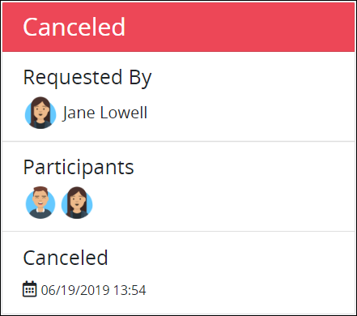
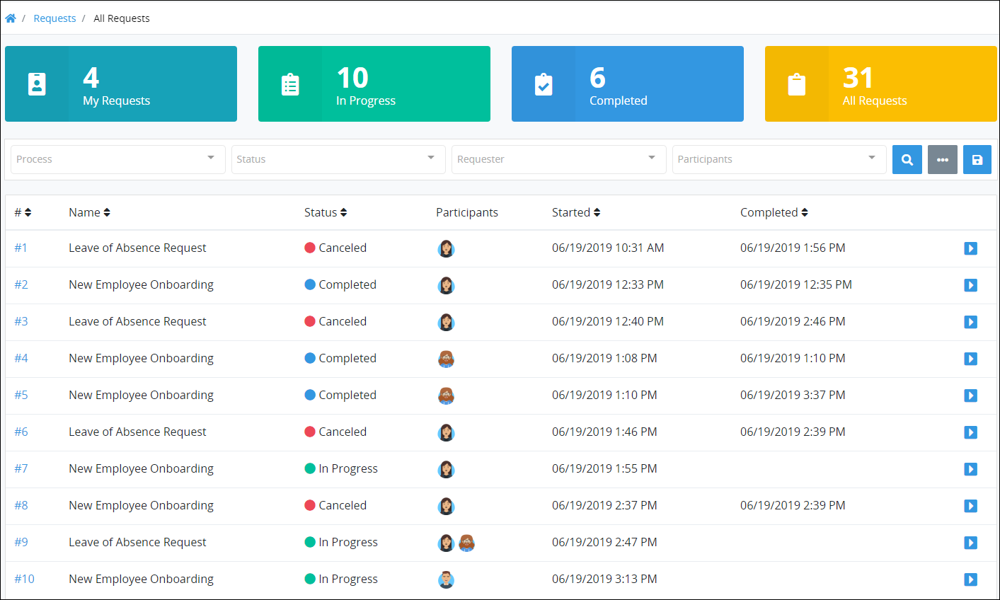

# Cancel a Request

## Overview

You can cancel a Request in the following circumstances:

* The Process associated with a Request is configured to [allow you or the group of which you are a member to cancel Requests for that Process](../../designing-processes/viewing-processes/view-the-list-of-processes/edit-the-name-description-category-or-status-of-a-process.md#edit-general-information-about-a-process).
* Any [ProcessMaker Administrator](../../start-here/how-to-use-this-document.md#processmaker-administrator) can cancel a Request associated with any active Process.

## Cancel a Request


If a Process is not configured to allow you to cancel Requests, then the **Cancel** button to cancel Requests does not display in Request summaries associated with that Process.


Follow these steps to cancel a Request:

1. Ensure that you are [logged on](../log-in.md#log-on) to ProcessMaker Spark.
2. Do one of the following:
   * Click the **Requests** option from the top menu if it is not currently displayed. The **My Requests** page displays.
   * Click the Home breadcrumb iconif the **Requests** page is not currently displayed. The **My Requests** page displays.
3. View one of the following **Requests** pages:
   * **My Requests** page. See [View Your Requests That You Started](view-started-requests.md#view-your-requests).
   * **In Progress** page. See [View Requests That Are In Progress](view-in-progress-requests.md#view-in-progress-requests-in-which-you-are-participating).
   * **Completed** page. See [View Completed Requests](view-completed-requests.md#view-completed-requests-in-which-you-participated).
   * **All Requests** page. See [View All Requests](view-all-requests.md#view-all-requests-in-your-organization). \(Note that your ProcessMaker user account must have the [**Requests: View All Requests** permission](../../processmaker-administration/permission-descriptions-for-users-and-groups.md#requests) to view the **All Requests** page.\)
4. Do one of the following:

   * From the **\#** column, click the Request number associated with the Process displaying in the **Name** column to view its summary. This number represents the sequential occurrence of that Process.
   * Click the **Open Request** iconfor the Request you want to cancel.

   Information about the Request displays that includes the **Cancel** button. Note that if the Request associated with the Process is not configured to allow your ProcessMaker user account or group to cancel Requests, then the **Cancel Request** section and **Cancel** button does not display.

   

5. Click **Cancel**. A message displays to confirm you want to cancel the Request.  

   

6. Click **Confirm**. The Request is canceled.  

   

Canceled Requests display in the [**All Requests** page](view-all-requests.md). Note that your ProcessMaker user account must have the [**Requests: View All Requests** permission](../../processmaker-administration/permission-descriptions-for-users-and-groups.md#requests) to view the **All Requests** tab.

## Related Topics

















