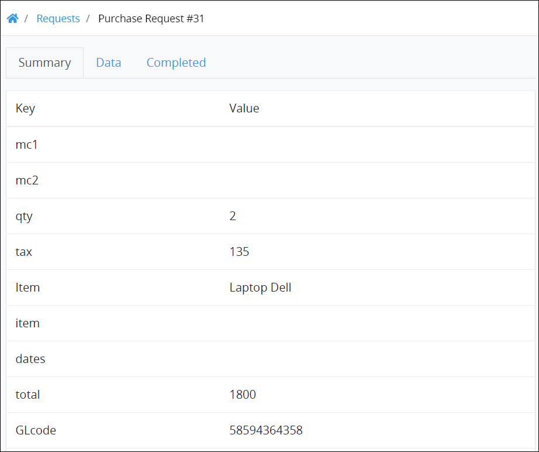
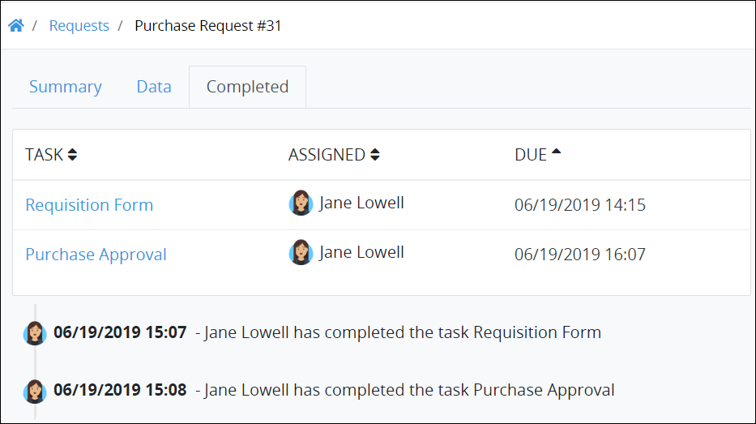
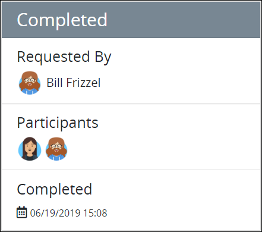

# Summary for Completed Requests

## Overview

Follow these steps to view a summary for a completed Request:

1. View one of the following **Requests** pages:
   * **My Requests** page. See [View Your Requests That You Started](../view-started-requests.md#view-your-requests).
   * **Completed** page. See [View Completed Requests](../view-completed-requests.md#view-completed-requests-in-which-you-participated).
   * **All Requests** page. See [View All Requests](../view-all-requests.md#view-all-requests-in-your-organization). \(Note that your ProcessMaker user account must have the [**Requests: View All Requests** permission](../../../processmaker-administration/permission-descriptions-for-users-and-groups.md#requests) to view the **All Requests** page.\)
2. Do one of the following:
   * From the **\#** column in the Request page, click the Request number associated with the Process that you want to view. That Request's summary displays.
   * Click the **Open Request** iconfor a Request. That Request's summary displays.

## Values in the Request

The **Summary** tab displays the summary of information entered into the completed Request. Request information may be entered in the following ways:

* Request participants manually enter information into ProcessMaker Screens. ProcessMaker Screens are digital forms.
* Authenticated users submit data through the ProcessMaker Spark REST API.

The **Summary** tab displays the JSON-formatted key/value pairs in tabular format that represent ProcessMaker Screen control data. Information is displayed:

* **KEY:** The **KEY** column displays the JSON key name that represents the ProcessMaker Screen control name the Request participant entered data or specified through the ProcessMaker Spark REST API. For example, a Text control to enter your name could be named `Full Name` which would display in the **Key** column here.
* **VALUE:** The **VALUE** column displays that key's value as entered by a person manually interacting with a form or specified through the ProcessMaker Spark REST API. For example, a Text control to enter your name could have the value `John Doe` which would display in the **Value** column here.

Below the table, the history of the Request displays all Request actions. See [Request History](summary-for-completed-requests.md#request-history).


### Summary Tab Displays Information for Completed Requests

The **Summary** tab only displays information for completed Requests. If you select the **Summary** tab for an in-progress Request, the following message displays: **Request In Progress: This Request is currently in progress. This screen will be populated once the Request is completed.**

### Display Information the Way You Want It

[Control how tabular information displays](../../control-how-requests-display-in-a-tab.md), including how to sort columns or how many items display per page.


## Editable Request Data


Your user account or group membership must have the [**Requests: Edit Request Data** permission](../../../processmaker-administration/permission-descriptions-for-users-and-groups.md#requests) to edit Request data.

See the [Request permissions](../../../processmaker-administration/permission-descriptions-for-users-and-groups.md#requests) or ask your ProcessMaker Administrator for assistance.


The **Data** tab displays the data from a completed Request in JSON format. The **Data** column only displays when that Request is completed.

Follow these steps to edit and save the completed Request data from those values that were submitted in the Request:

1. View the **Data** tab. Note that the **Data** tab does not display until the Request is completed.
2. From the editable JSON field, change the values that were submitted during the Request to those that you want.
3. Click **Save**. The following message displays when the Request values are changed: **Request data successfully updated**.

Below the editable JSON field, the history of the Request displays all Request actions. See [Request History](summary-for-completed-requests.md#request-history).

## Completed Tasks Summary

The **Completed** tab displays the summary of all assigned Tasks to Request participants for the selected completed Request.

The **Completed** tab displays the following summary in tabular format about assigned Tasks to Request participants for the completed Requests:

* **Task:** The **Task** column displays the name of each completed Task in the selected Request. 
* **Assigned:** The **Assigned** column displays the username's avatar to whom the Task was assigned. Hover your cursor over a user's avatar to view that person's full name.
* **Due:** The **Due** column displays the date the Task was due. The time zone setting to display the time is according to the ProcessMaker Spark server unless your [user profile's](../../profile-settings.md#change-your-profile-settings) **Time zone** setting is specified.

Below the table, the history of the Request displays all Request actions. See [Request History](summary-for-completed-requests.md#request-history).


### Not a Completed Request?

If the selected Request is not completed, the following message displays: **No Results**.

### Display Information the Way You Want It

[Control how tabular information displays](../../control-how-requests-display-in-a-tab.md), including how to sort columns or how many items display per page.


## Files Associated with the Request

The **Files** tab displays the summary of all files associated with the completed Request. The **Files** tab only displays if at least one file was uploaded to the Request. The name of each file is linked to the file so you can download that file to your local computer or network location.

The **Files** tab displays the following summary in tabular format about the files associated with the Request:

* **File Name:** The **File Name** column displays the name of each associated with the selected Request. Click the file name to download it to your local computer or network location. 
* **MIME Type:** The **MIME Type** column displays the MIME type for the associated file.
* **Created At:** The **Created At** column displays the date the file became associated with the selected Request. The file became associated with the Request when the person who attached it submitted the [ProcessMaker Screen](../../../designing-processes/design-forms/what-is-a-form.md) to which the file was uploaded. The time zone setting to display the time is according to the ProcessMaker Spark server unless your [user profile's](../../profile-settings.md#change-your-profile-settings) **Time zone** setting is specified.

Below the table, the history of the Request displays all Request actions. See [Request History](summary-for-completed-requests.md#request-history).

## Request Participants

Each completed Request displays a summary of the Request participants.

The following summary displays about participants in a completed Request:

* **Requested By:** The **Requested By** field displays the avatar and full name of the person who started the selected Request. Hover your cursor over a user's avatar to view that person's full name.
* **Participants:** The **Participants** field displays each Request participant's avatar in the selected Request. Hover your cursor over a user's avatar to view that person's full name.
* **Request completion date:** The date and time the Request was completed displays below the **Participants** field. The time zone setting to display the time is according to the ProcessMaker Spark server unless your [user profile's](../../profile-settings.md#change-your-profile-settings) **Time zone** setting is specified.

## Request History

Below the tabular information summarizing the Request displays that Request's history: all Request actions to that time. The oldest Request actions display at the top of the Request history.

The following information displays about each event in the Request history:

* **Request participant:** The Request participant who performed the action is represented by his or her avatar. Hover your cursor over a user's avatar to view that person's full name. If the ProcessMaker system performed an action by running a ProcessMaker Script or other automatic function, that action is represented by "S" avatar.
* **Date and time the action occurred:** To the right of the Request participant displays the date and time the Request action occurred. The time zone setting to display the time is according to the ProcessMaker Spark server unless your [user profile's](../../profile-settings.md#change-your-profile-settings) **Time zone** setting is specified.
* **Description of the action:** To the right of when the Request action occurred displays a description of that action. The ProcessMaker system generates this action description.

## Related Topics

















