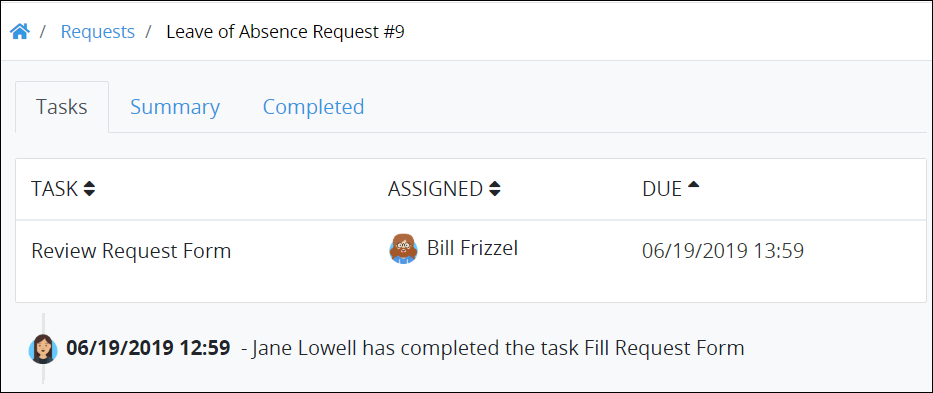
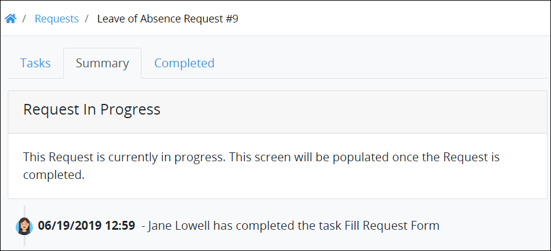
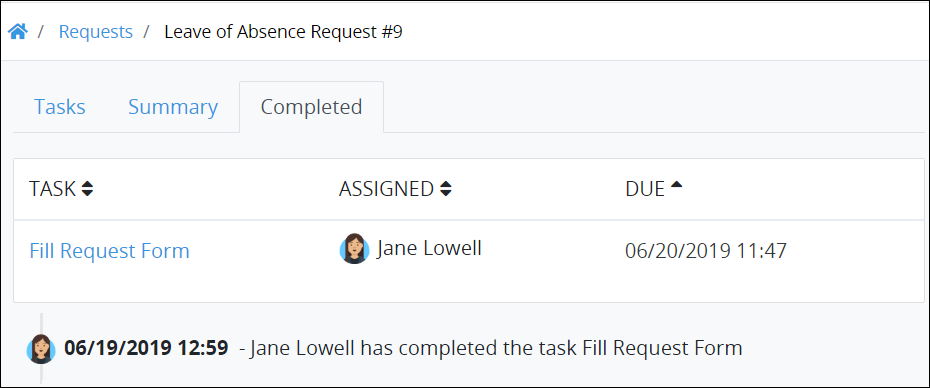
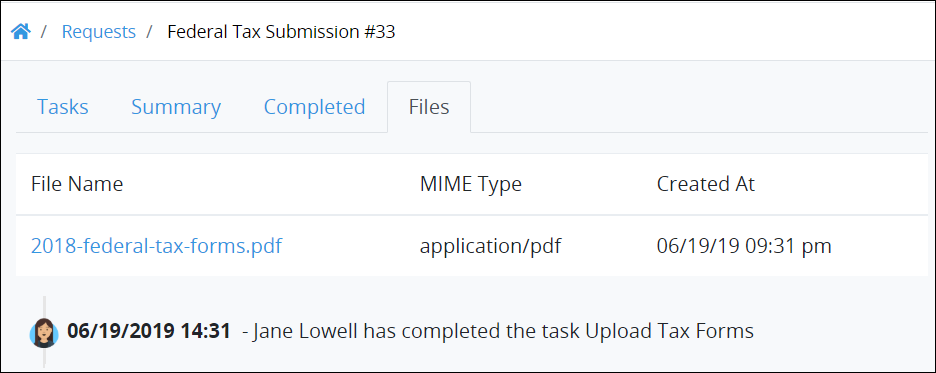
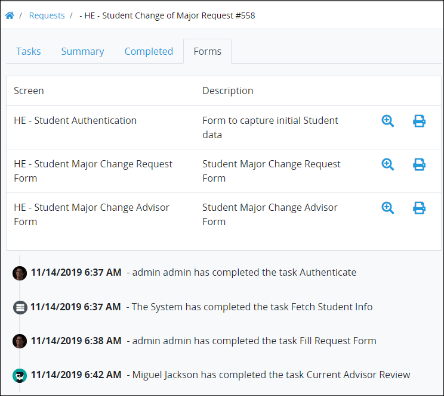
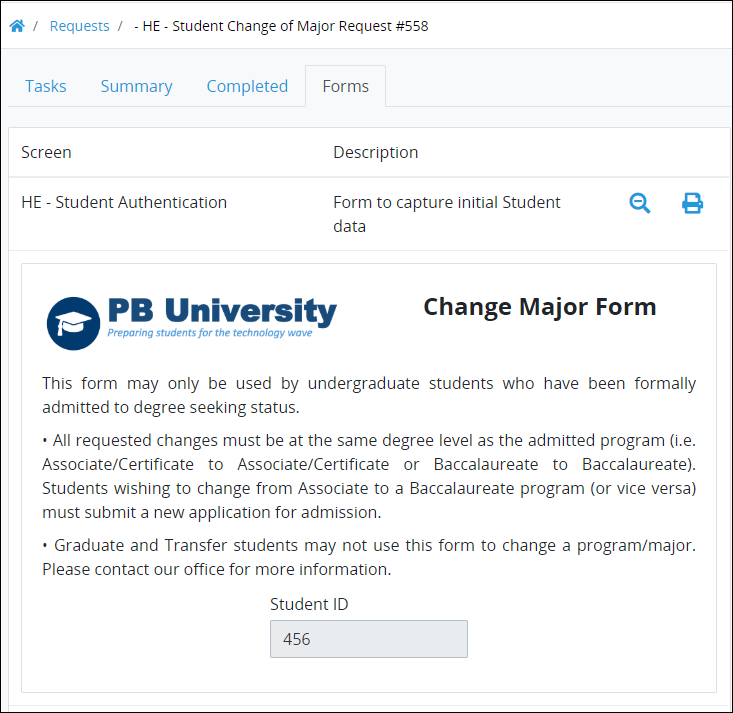
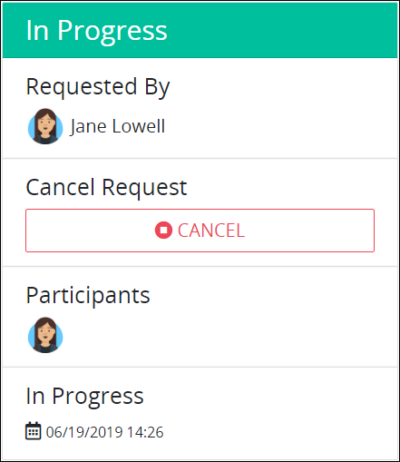
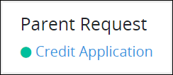
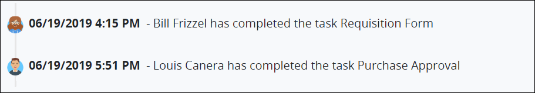

# Summary for In-Progress Requests

## Overview

Follow these steps to view a summary for an in-progress [Request](../what-is-a-request.md):

1. Ensure that you are [logged on](../../log-in.md#log-on) to ProcessMaker.
2. View one of the following **Requests** pages:
   * **My Requests** page. See [View Your Requests That You Started](../view-started-requests.md#view-your-requests).
   * **In Progress** page. See [View Requests That Are In Progress](../view-in-progress-requests.md#view-in-progress-requests-in-which-you-are-participating).
   * **All Requests** page. See [View All Requests](../view-all-requests.md#view-all-requests-in-your-organization). \(Note that your ProcessMaker user account must have the [**Requests: View All Requests** permission](../../../processmaker-administration/permission-descriptions-for-users-and-groups.md#requests) to view the **All Requests** page.\)
3. Do one of the following:
   * From the **\#** column in the Request page, click the Request number associated with the Process that you want to view. That Request's summary displays.
   * Click the **Open Request** iconfor a Request. That Request's summary displays.

## Tasks Assigned to Request Participants

The **Tasks** tab displays the summary for all assigned Tasks to Request participants to that time.

The **Tasks** tab displays the following summary in tabular format about assigned [Tasks](../../task-management/what-is-a-task.md) to Request participants to that time:

* **\#:** The **\#** column displays the Task ID associated with its [Process](../../../designing-processes/viewing-processes/what-is-a-process.md). Each time that Task is assigned to a Request participant, the ID for that Task increments by one.
* **Task:** The **Task** column displays the name of each Task to be completed for the selected Request for all Request participants. If a Task is assigned to you, a hyperlink displays in the Task name.
* **Assigned:** The **Assigned** column displays the username's avatar to whom the Task is assigned. Hover your cursor over a user's avatar to view that person's full name.
* **Due:** The **Due** column displays the date the Task is due. The time zone setting to display the time is according to the ProcessMaker instance unless your [user profile's](../../profile-settings.md#change-your-processmaker-settings) **Time zone** setting is specified.

Below the table, the history of the Request displays all Request actions. See [Request History](summary-for-in-progress-requests.md#request-history).


### No Assigned Tasks?

If there are no assigned Tasks for the selected Request, the following message displays: **No Data Available**.

### Display Information the Way You Want It

[Control how tabular information displays](../../control-how-requests-display-in-a-tab.md), including how to sort columns or how many items display per page.


## Values in the Request

The **Summary** tab displays the summary of information entered into the Request when a Request completes. However, because the Request is in progress, there are no Request values to display. The **Summary** tab displays the following message: **This Request is currently in progress. This screen will be populated once the Request is completed**.

Below this message, the history of the Request displays all Request actions. See [Request History](summary-for-in-progress-requests.md#request-history).

## Completed Tasks Summary

The **Completed** tab displays the summary of all Tasks Request participants completed to that time.

The **Completed** tab displays the following summary in tabular format about completed Tasks participants completed to that time in the Request:

* **\#:** The **\#** column displays the Task ID associated with its [Process](../../../designing-processes/viewing-processes/what-is-a-process.md). Each time that Task is assigned to a Request participant, the ID for that Task increments by one.
* **Task:** The **Task** column displays the name of each completed Task in the selected Request. 
* **Assigned:** The **Assigned** column displays the username's avatar to whom the Task was assigned. Hover your cursor over a user's avatar to view that person's full name.
* **Due:** The **Due** column displays the date the Task was due. The time zone setting to display the time is according to the ProcessMaker instance unless your [user profile's](../../profile-settings.md#change-your-processmaker-settings) **Time zone** setting is specified.

Below the table, the history of the Request displays all Request actions. See [Request History](summary-for-in-progress-requests.md#request-history).


### There Are No Completed Tasks?

If the selected Request has no completed Tasks, the following message displays: **No Data Available**.

### Display Information the Way You Want It

[Control how tabular information displays](../../control-how-requests-display-in-a-tab.md), including how to sort columns or how many items display per page.


## Files Associated with the Request

The **Files** tab displays the summary of all files associated with the Request to that time. The **Files** tab only displays in that Request summary if one of the following occurs:

* At least one file has been uploaded to that Request.
* A [PDF Generator connector](../../../designing-processes/process-design/model-processes-using-connectors/available-connectors-from-processmaker/pdf-generator-connector.md) in that Request has automatically generated a PDF of a [Display](../../../designing-processes/design-forms/screens-builder/types-for-screens.md)-type [ProcessMaker Screen](../../../designing-processes/design-forms/what-is-a-form.md). Note that to use the PDF Generator connector, the [PDF Generator package](../../../package-development-distribution/package-a-connector/pdf-generator-package.md) must be installed in your ProcessMaker instance. The PDF Generator [package](../../../package-development-distribution/first-topic.md) is not available in the ProcessMaker open-source edition. Contact [ProcessMaker Sales](https://www.processmaker.com/contact/) or ask your ProcessMaker sales representative how the PDF Generator package can be installed in your ProcessMaker instance.

The **Files** tab displays the following summary in tabular format about the files associated with the Request:

* **File Name:** The **File Name** column displays the name of each file associated with the selected Request. Click the file name to download it to your local computer or network location. 
* **MIME Type:** The **MIME Type** column displays the MIME type for the associated file.
* **Created At:** The **Created At** column displays the date the file became associated with the selected Request. The file became associated with the Request when the person who attached it submitted the [ProcessMaker Screen](../../../designing-processes/design-forms/what-is-a-form.md) to which the file was uploaded. The time zone setting to display the time is according to the ProcessMaker instance unless your [user profile's](../../profile-settings.md#change-your-processmaker-settings) **Time zone** setting is specified.

Below the table, the history of the Request displays all Request actions. See [Request History](summary-for-in-progress-requests.md#request-history).

## Forms Associated with the Request

The **Forms** tab displays the ProcessMaker [Screen](../../../designing-processes/design-forms/what-is-a-form.md) associated with each Task that each Request participant submitted in the Request to that time. For example, if a Request participant entered information into a ProcessMaker Screen, all Request participants can view the Request data that the Task assignee entered.

The **Forms** tab displays the following summary in tabular format about submitted ProcessMaker Screens by Request participants to that time in the Request:

* **Screen:** The **Screen** column displays the name of each submitted ProcessMaker Screen in the selected Request.
* **Description:** The **Description** column displays the description of each ProcessMaker Screen.


### View a ProcessMaker Screen and Its Submitted Request Data

To view a ProcessMaker Screen and the Request data submitted by a Request participant, click the **Details** icon. The submitted ProcessMaker Screen displays.  
 

Click the **Details** iconagain to hide the displayed ProcessMaker Screen and its Request data.

### Print the ProcessMaker Screen and its Submitted Request Data

To print a ProcessMaker and its Request data, click the **Print** icon. A print preview displays in a new browser window from which you can select an accessible printer.


Below the table, the history of the Request displays all Request actions. See [Request History](summary-for-in-progress-requests.md#request-history).


### There Are No Forms?

If the selected Request has no ProcessMaker Screens with submitted Request data, the following message displays: **No Data Available**.


## Summary

Each in-progress Request displays a summary of the Request to that time.

The following summary displays about an in-progress Request:

* **Requested By:** The **Requested By** field displays the avatar and full name of the person who started the selected Request. Hover your cursor over a user's avatar to view that person's full name.
* **Cancel Request:** The **Cancel Request** field allows a Request participant or ProcessMaker Administrator to cancel the Request if that Request participant's user account has the appropriate permission to cancel Requests for that Process. If your user account does not have the permission\(s\) to cancel Requests for that Process, the **Cancel Request** field does not display. See [Cancel a Request](../delete-a-request.md).
* **Child Requests:** The **Child Requests** field displays any child Requests associated with this Request, referred to as the parent Request when a child Request exists. A child Request is one from which this Request automatically started as designed in its associated Process. All child Requests have their own statuses since each routes independently of their parent Request. Click the link for any child Request to view the Request summary for that child Request. For example, a child Request represents a [Sub Process](https://processmaker.gitbook.io/processmaker/designing-processes/process-design/model-your-process/add-and-configure-sub-process-elements). If there are no child Requests associated with this Request, the **Child Requests** field does not display. The status icon displays beside each child Request. See [View Your Requests](../view-started-requests.md#view-your-requests) for descriptions of each status icon.
* **Parent Request:** The **Parent Request** field displays the parent Request associated with this Request, referred to as the child Request when a parent Request exists. The parent Request is one that automatically started this Request as designed in its associated Process. The parent Request has its own status since it routes independently of its child Request\(s\). Click the link for the parent Request to view the Request summary for that Request. For example, a parent Request represents the main Process that started a [Sub Process](https://processmaker.gitbook.io/processmaker/designing-processes/process-design/model-your-process/add-and-configure-sub-process-elements) Request. If there is no parent Request associated with this Request, the **Parent Request** field does not display. The status icon displays beside the parent Request. See [View Your Requests](../view-started-requests.md#view-your-requests) for descriptions of each status icon. Below is an example of a Parent Request in a Request summary.  
* **Participants:** The **Participants** field displays each Request participant's avatar in the selected Request to that time. Hover your cursor over a user's avatar to view that person's full name.
* **Request creation date:** The date and time the Request was created displays below the **Participants** field. The time zone setting to display the time is according to the ProcessMaker instance unless your [user profile's](../../profile-settings.md#change-your-processmaker-settings) **Time zone** setting is specified.

## Request History

Below the tabular information summarizing the Request displays that Request's history: all Request actions to that time. The oldest Request actions display at the top of the Request history.

The following information displays about each event in the Request history:

* **Request participant:** The Request participant who performed the action is represented by his or her avatar. Hover your cursor over a user's avatar to view that person's full name. If the ProcessMaker system performed an action by running a ProcessMaker Script or other automatic function, that action is represented by "S" avatar.
* **Date and time the action occurred:** To the right of the Request participant displays the date and time the Request action occurred. The time zone setting to display the time is according to the ProcessMaker instance unless your [user profile's](../../profile-settings.md#change-your-processmaker-settings) **Time zone** setting is specified.
* **Description of the action:** To the right of when the Request action occurred displays a description of that action. The ProcessMaker system generates this action description.

## Related Topics



















