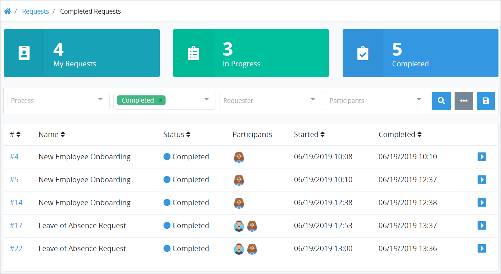

# View Completed Requests

## View Completed Requests in Which You Participated

The **Completed** page displays completed Requests in which you participated. You were a Request participant because you started that Request or were assigned a Task in that Request. Request information displays in tabular format.

Follow these steps to view completed Requests in which you participated:

1. Ensure that you are [logged on](../log-in.md#log-on) to ProcessMaker.
2. Do one of the following:
   * Click the **Requests** option from the top menu if it is not currently displayed. The **My Requests** page displays.
   * Click the Home breadcrumb iconif the **Requests** page is not currently displayed. The **My Requests** page displays.
3. Click the **Completed** tab or click the **Completed** iconfrom the left sidebar. The **Completed** page displays.

Below is an example of the **Completed** page that displays completed Requests. The [Saved Search package](../../package-development-distribution/package-a-connector/saved-searches-package.md) is not installed in this example, so this page displays in the ProcessMaker open-source edition.

The **Completed** page displays the following information in tabular format about completed Requests:

* **\#:** The **\#** column displays the Request number associated with the Process. This number represents the sequential occurrence of that Process.
* **Name:** The **Name** column displays the Process name associated with the Request. Click the Process name to [view the Request summary](request-details/#information-for-completed-requests).
* **Status:** The **Status** column displays the **Completed** status for all Requests in this view.
* **Participants:** The **Participants** column displays each Request participant's avatar. Hover your cursor over a user's avatar to view that person's full name.
* **Started:** The **Started** column displays the date and time you made the Request. The time zone setting to display the time is according to the ProcessMaker instance unless your [user profile's](../profile-settings.md#change-your-profile-settings) **Time zone** setting is specified.
* **Completed:** The **Completed** column displays the date and time the Request was completed. The time zone setting to display the time is according to the ProcessMaker instance unless your [user profile's](../profile-settings.md#change-your-profile-settings) **Time zone** setting is specified.


### View a Request Summary

To [view a Request summary](request-details/), do one of the following:

* From the **\#** column, click the Request number associated with the Process displaying in the **Name** column to view its summary. This number represents the sequential occurrence of that Process.
* Click the **Open Request** iconfor the Request to view its summary.

### Search for a Request

Use Request data to search for Requests on this page based on the following criteria:

* **Process:** Search using one or more Process names associated with a Request.
* **Status:** Search using one or more of the following Request statuses:
  * **In progress:** Include Requests that are in progress as part of your search criteria.
  * **Completed:** Include Requests that are completed as part of your search criteria. Requests that are completed are included by default when searching for Requests on this page.
  * **Error:** Include Requests that are in error as part of your search criteria.
  * **Canceled:** Include Requests that have been canceled as part of your search criteria.
* **Requester:** Search using one or more the ProcessMaker users who started a Request.
* **Participants:** Search using one or more ProcessMaker users participating in a Request.

You can do [basic](search-for-a-request.md#do-a-basic-search-for-a-request) and [advanced](search-for-a-request.md#do-an-advanced-search-for-a-request) searches for Requests.

### Save the Settings of a Search

If the [Saved Searches package](../../package-development-distribution/package-a-connector/saved-searches-package.md) is installed in your ProcessMaker instance, you may save search parameters and share them with other ProcessMaker [users](../../processmaker-administration/add-users/what-is-a-user.md) and [groups](../../processmaker-administration/assign-groups-to-users/what-is-a-group.md) by clicking the **Save Search** button. See [Create and Share a Saved Search](../save-and-share-request-and-task-related-searches/create-and-share-a-saved-search.md).

If the Saved Searches package is not installed, the **Save Search** button is not available.

### No Requests?

If there are no Requests in this tab, the following message displays: **No Results**.

### Display Information the Way You Want It

[Control how tabular information displays](../control-how-requests-display-in-a-tab.md), including how to sort columns or how many items display per page.


## Related Topics

















