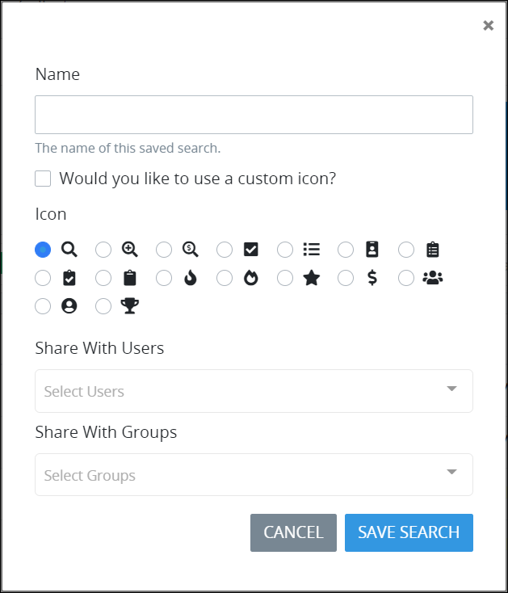

# Create and Share a Saved Search

## Create and Share a Saved Search


### ProcessMaker Package Required

To create and share [Saved Searches](what-is-a-saved-search.md), the [Saved Searches package](../../package-development-distribution/package-a-connector/saved-searches-package.md) must be installed in your ProcessMaker instance. The Saved Searches package is not available in the ProcessMaker open-source edition. Contact [ProcessMaker Sales](mailto:sales@processmaker.com) or ask your ProcessMaker sales representative how the Saved Searches package can be installed in your ProcessMaker instance.


Follow these steps to create and share a Saved Search:

1. Enter the search criteria for either a [Request](../requests/search-for-a-request.md) or [Task](../task-management/search-for-a-task.md) search. It is this criteria from which the Saved Search settings are based.
2. Click the **Save Search** button. The **Save Search** screen displays.  
3. In the **Name** field, enter the name of your Saved Search. Since this name displays in the left sidebar of **Requests**/**Tasks** pages, ensure that this is a descriptive name based on the ProcessMaker Query Language \(PMQL\) parameters that compose the search. This name is helpful for yourself and those with whom you share this Saved Search to know for what this Saved Search's results are. This is a required field.
4. Follow these guidelines to select an image that represents the Saved Search results. Saved Searches associated with Requests display in the left sidebar of **Requests** pages, while those associated with Tasks display in the left sidebar of **Tasks** pages.
   * **Follow this step to select an image from ProcessMaker to represent the Saved Search:**

     Select any of the images that ProcessMaker provides by selecting its radio button.

   * **Follow these steps to select a custom image to represent the Saved Search:**
     1. Click the **Would you like to use a custom icon?** checkbox. The **Choose File** button displays.
     2. Click the **Choose File** button and locate the icon that represents the Saved Search. The icon must not be larger than 2 kilobytes large or the following message displays below the **Choose File** button: **The file is too large. File size must be less than 2KB when base64 encoded.**.
5. From the **Share With Users** drop-down menu, select with which ProcessMaker user\(s\) to share your Saved Search by selecting the person's full name. Multiple ProcessMaker users may be added, one at a time, to this field. You may click the Remove icon to remove a ProcessMaker user from the **Share With Users** drop-down menu. These selected ProcessMaker users will see your Saved Search in left sidebars of **Requests**/**Tasks** pages with the image you selected.  
6. From the **Share With Groups** drop-down menu, select with which ProcessMaker group\(s\) to share your Saved Search by selecting the group. Multiple ProcessMaker groups may be added, one at a time, to this field. You may click the Remove icon to remove a ProcessMaker group from the **Share With Groups** drop-down menu. Members of these selected ProcessMaker groups will see your Saved Search in left sidebars of **Requests**/**Tasks** pages with the image you selected.  
7. Click the **Save Search** button.

## Related Topics













