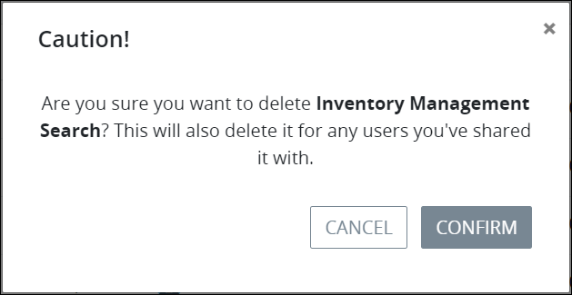

# Manage Your Own Saved Searches

## Manage Your Own Saved Searches


To manage [Saved Searches](what-is-a-saved-search.md), the [Saved Searches package](../../package-development-distribution/package-a-connector/saved-searches-package.md) must be installed in your ProcessMaker instance. The Saved Searches package is not available in the ProcessMaker open-source edition. Contact [ProcessMaker Sales](mailto:sales@processmaker.com) or ask your ProcessMaker sales representative how the Saved Searches package can be installed in your ProcessMaker instance.


You can manage your own Saved Searches. However, you cannot manage Saved Searches which have been shared with you. You can only manage those that you have [created](create-and-share-a-saved-search.md).

Follow these steps to manage your own Saved Searches:

1. View all Saved Searches that you have created and which have been shared with you from any of the following pages:
   * **Requests** pages:
     * **My Requests** page. See [View Your Requests That You Started](../requests/view-started-requests.md#view-your-requests).
     * **In Progress** page. See [View Requests That Are In Progress](../requests/view-in-progress-requests.md#view-in-progress-requests-in-which-you-are-participating).
     * **Completed** page. See [View Completed Requests](../requests/view-completed-requests.md#view-completed-requests-in-which-you-participated).
     * **All Requests** page. See [View All Requests](../requests/view-all-requests.md#view-all-requests-in-your-organization). \(Note that your ProcessMaker user account must have the [**Requests: View All Requests** permission](../../processmaker-administration/permission-descriptions-for-users-and-groups.md#requests) to view the **All Requests** page.\)
   * **Tasks** pages:
     * **To Do** page. See [View Tasks You Need to Do](../task-management/view-tasks-you-need-to-do.md).
     * **Completed** page. See [View Completed Tasks](../task-management/view-completed-tasks.md).
2. Click the **My Saved Searches** iconfrom the left sidebar. The **My Saved Searches** page displays.

The **My Saved Searches** page displays the following information in tabular format about your Saved Searches and those which have been shared with you:

* **Name:** The **Name** column displays the name of the Saved Search.
* **Type:** The **Type** column displays the type of Saved Search:
  * **Request:** The Saved Search is based on [Request search](../requests/search-for-a-request.md#save-and-share-a-search) parameters.
  * **Task:** The Saved Search is based on [Task search](../task-management/search-for-a-task.md) parameters.
* **Created By:** The **Created By** column displays the ProcessMaker user's avatar who created the Saved Search. Hover your cursor over the ProcessMaker user's avatar to view that person's full name.
* **Modified:** The **Modified** column displays the date and time the Saved Search was last modified by the ProcessMaker user that created the Saved Search. A Saved Search can only be modified by the ProcessMaker user that created it. The time zone setting to display the time is according to the ProcessMaker instance unless your [user profile's](../profile-settings.md#change-your-profile-settings) **Time zone** setting is specified.
* **Created:** The **Created** column displays the date and time the Saved Search was created. The time zone setting to display the time is according to the ProcessMaker instance unless your [user profile's](../profile-settings.md#change-your-profile-settings) **Time zone** setting is specified.

Use the **My Saved Searches** page to manage your own Saved Searches by using the following options:

* Hide one of your Saved Searches. See [Hide One of Your Own Saved Searches](manage-your-saved-searches.md#hide-one-of-your-saved-searches).
* Configure one of your Saved Searches. See [Configure One of Your Own Saved Searches](manage-your-saved-searches.md#configure-one-of-your-saved-searches).
* Delete one of your Saved Searches. See [Delete One of Your Own Saved Searches](manage-your-saved-searches.md#delete-one-of-your-saved-searches).

Saved Searches that do not have these options are those which have been shared with you. A Saved Search can only be managed by the ProcessMaker [user](../../processmaker-administration/add-users/what-is-a-user.md) that creates it. Therefore, there are no options for Saved Searches shared with you. You may only use Saved Searches shared with you by [viewing their search results](view-saved-searches-that-are-shared-with-you.md).


### No Saved Searches?

If there are no Saved Searches, the following message displays: **No Results**.

### Display Information the Way You Want It

[Control how tabular information displays](../control-how-requests-display-in-a-tab.md), including how to sort columns or how many items display per page.


### Hide One of Your Own Saved Searches

Hiding a Saved Search only hides that Saved Search from you using it from the left sidebar of the Request- and Task-related pages. Sharing recipients of that Saved Search may still use it to view search results using your Saved Search's parameters.

Follow these steps to hide one of your own Saved Searches:

1. [View all the Shared Searches that you have created and which have been shared with you](manage-your-saved-searches.md#manage-your-own-saved-searches). The **My Saved Searches** page displays.
2. Click the **Hide Saved Search** icon. The Saved Search is hidden, indicated by diminished visibility of that Saved Search in the **My Saved Searches** page.

### Show One of Your Hidden Saved Searches

Showing a hidden Saved Search allows you to use that Saved Search again from the left sidebar of the Request- and Task-related pages.

Follow these steps to show one of your hidden Saved Searches:

1. [View all the Shared Searches that you have created and which have been shared with you](manage-your-saved-searches.md#manage-your-own-saved-searches). The **My Saved Searches** page displays.
2. Click the **Show Saved Search** icon. The Saved Search is visible, indicated by full visibility of that Saved Search in the **My Saved Searches** page.

### Configure One of Your Own Saved Searches

### Delete One of Your Own Saved Searches


Consider carefully whether to delete one of your own Saved Searches. When deleting a Shared Search, it is no longer shared with those ProcessMaker users and/or groups with which you have shared them. The recipients of your shared Saved Search will no longer be able to use it to quickly view search results using your Shared Search's parameters.


Follow these steps to delete one of your own Saved Searches:

1. [View all the Shared Searches that you have created and which have been shared with you](manage-your-saved-searches.md#manage-your-own-saved-searches). The **My Saved Searches** page displays.
2. Click the **Delete** icon. The **Caution** screen displays to confirm the deletion of the Saved Search.   
3. Click **Confirm**.

## Related Topics

