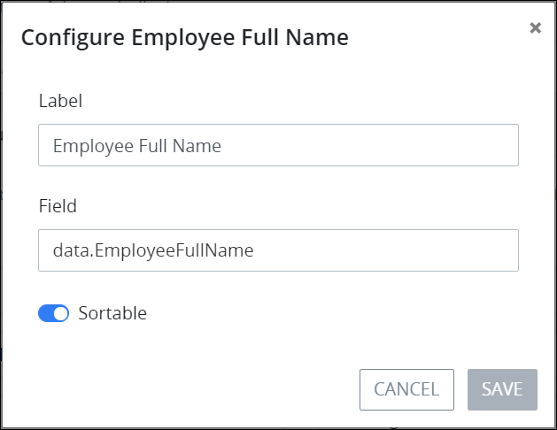
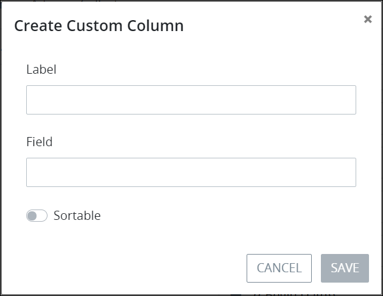
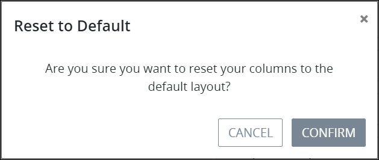

# Configure a Saved Search

## Configure a Saved Search


### Don't Know What a Saved Search Is?

See [What is a Saved Search?](../what-is-a-saved-search.md) to learn how you can share the same Request and Task search parameters with other ProcessMaker users in your organization.

### ProcessMaker Package Required

To configure a [Saved Search](../what-is-a-saved-search.md), the [Saved Searches package](../../../package-development-distribution/package-a-connector/saved-searches-package.md) must be installed in your ProcessMaker instance. The Saved Searches package is not available in the ProcessMaker open-source edition. Contact [ProcessMaker Sales](mailto:sales@processmaker.com) or ask your ProcessMaker sales representative how the Saved Searches package can be installed in your ProcessMaker instance.


### Select the Saved Search to Configure

You may configure only one of your own Saved Searches, not one which has been shared with you. Configure a Saved Search regardless of whether it is [visible](hide-or-show-a-saved-search.md#show-your-hidden-saved-search) or [hidden](hide-or-show-a-saved-search.md#hide-your-own-saved-search).

Follow these steps to select the Saved Search to configure:

1. [View the Shared Searches for a specific Saved Search type](./#manage-your-own-saved-searches). The **Edit Saved Searches** page displays.
2. Click the **Configure** icon for the Saved Search to configure.  
3. Refer to the following sections to configure your Saved Search. These configuration sections of your Saved Search may be configured independently of one another:
   * [Configure basic settings](configure-a-saved-search.md#configure-basic-settings)
   * [Configure how Saved Search information displays](configure-a-saved-search.md#configure-how-saved-search-information-displays)
   * [Select with which ProcessMaker Users to share the Saved Search](configure-a-saved-search.md#select-with-which-processmaker-users-to-share-the-saved-search)
   * [Select with which ProcessMaker Groups to share the Saved Search](configure-a-saved-search.md#select-with-which-processmaker-groups-to-share-the-saved-search)

### Configure Basic Settings

Follow these steps to configure basic settings for your Saved Search:

1. [Select the Saved Search to configure](configure-a-saved-search.md#select-the-saved-search-to-configure). The **Configuration** tab displays. Use the **Configuration** tab to configure basic settings for your Saved Search.  
2. Edit the following information in the **Configuration** tab about the Saved Search as necessary:
   * **Name:** In the **Name** field, edit the name of your Saved Search. This is a required field.
   * **Image:** Follow these guidelines to select an image that represents the Saved Search results. Saved Searches associated with Requests display in the left sidebar of **Requests** pages, while those associated with Tasks display in the left sidebar of **Tasks** pages.

     **Select an image from ProcessMaker to represent the Saved Search:**

     Select any of the images that ProcessMaker provides by selecting its radio button.

     **Select a custom image to represent the Saved Search:**

     1. Click the **Would you like to use a custom icon?** checkbox. The **Choose File** button displays.
     2. Click the **Choose File** button and locate the icon that represents the Saved Search. The icon must not be larger than 2 kilobytes large or the following message displays below the **Choose File** button: **The file is too large. File size must be less than 2KB when base64 encoded.**.

   * **PMQL:** In the **PMQL** field, edit the ProcessMaker Query Language \(PMQL\) parameters if necessary. See the following topics for information how to use PMQL for Requests and Tasks:
     * [Request searches using PMQL](../../requests/search-for-a-request.md#advanced-search-for-a-request)
     * [Task searches using PMQL](../../task-management/search-for-a-task.md#advanced-search-for-a-task)
3. Click **Save**.

### Configure How Saved Search Information Displays

Follow these steps to configure how information displays for your Saved Search:

1. [Select the Saved Search to configure](configure-a-saved-search.md#select-the-saved-search-to-configure). The **Configuration** tab displays.
2. Click the **Columns** tab. Use the **Columns** tab to customize a table from which to display search results for this Saved Search. The **Active Columns** column displays the currently selected columns that display information in the Saved Search's search results. The **Available Columns** column displays optional informational components to display in the Saved Search's search results. These available options are based on ProcessMaker's analysis of completed Requests for the Saved Search's selected Process.  
    

   The informational components in the **Active Columns** column display in the order that these informational components will display in search results. Informational components at the top of the **Active Columns** column display left-most in the column order; components at the bottom of the **Active Columns** column display right-most in the column order.

   It may be helpful to know how ProcessMaker analyzed completed Requests associated with the Process selected in your Saved Search. To derive that Request information, view the [**Data** tab in the summary for a completed Request](../../requests/request-details/summary-for-completed-requests.md#editable-request-data) to view the data from a completed Request. The key names \(represented in red-colored text\) represent Request data. Note that your ProcessMaker user account or group membership must have the [Requests: Edit Request Data](../../../processmaker-administration/permission-descriptions-for-users-and-groups.md#requests) permission. Ask your ProcessMaker Administrator if you do not see the **Data** tab in completed Requests.

3. Follow these guidelines to select which column\(s\) display information in the Saved Search results:

   **Remove a column that displays information in the Saved Search results:**

   1. From the **Active Columns** column, click the **Remove** iconfor the informational component not to display in the Saved Search's search results. The removed informational component moves to the bottom of the **Available Columns** column.

   **Add and configure a column that displays information in the Saved Search results:**

   1. Drag the informational component from the **Available Columns** column to the **Active Columns** column, and then place the informational component in the order from top-to-bottom that you want that informational component to display in search results. Informational components at the top of the **Active Columns** column display left-most in the column order; components at the bottom of the **Active Columns** column display right-most in the column order.
   2. Informational components that are not ProcessMaker defaults can be configured to display a label and what the informational component represents.

   **Configure how a column displays information in the Saved Search results:**

   1. Click the **Configuration** iconfor the informational component placed from the **Available Columns** column. The **Configure** screen for that informational component displays.  Columns that do not have the **Configuration** icon are ProcessMaker default columns that cannot be configured, but only removed from search results.
   2. In the **Label** field, edit the column label that displays in search results \(if necessary\).
   3. In the **Field** field, edit the key name that represents the Request data \(if necessary\). `data.` represents that what follows derives from Request information. To derive that Request information if it is necessary to change the **Field** field value, view the [**Data** tab in the summary for a completed Request](../../requests/request-details/summary-for-completed-requests.md#editable-request-data) to view the data from a completed Request, and then use the specific key name \(represented in red-colored text\) in the following syntax, where `RequestData` represents the key name: `data.RequestData`. Note that your ProcessMaker user account or group membership must have the [Requests: Edit Request Data](../../../processmaker-administration/permission-descriptions-for-users-and-groups.md#requests) permission. Ask your ProcessMaker Administrator if you do not see the **Data** tab in completed Requests.
   4. Use the **Sortable** toggle key to adjust whether the column is sortable in search results.
   5. Click **Save**.

   **Add a custom column to include additional information in the Save Search results:**

   1. Click the **Add Custom Column** button at the bottom of the **Available Columns** column. The **Create Custom Column** screen displays. Use the **Add Custom Column** screen to add a custom column to include an informational component that ProcessMaker's analysis of completed Requests for the Saved Search's selected Process did not provide. 
   2. In the **Label** field, enter the column label that displays in search results.
   3. In the **Field** field, enter the key name that represents the Request data. `data.` represents that what follows derives from Request information. To derive that Request information, view the [**Data** tab in the summary for a completed Request](../../requests/request-details/summary-for-completed-requests.md#editable-request-data) to view the data from a completed Request, and then use the specific key name \(represented in red-colored text\) in the following syntax, where `RequestData` represents the key name: `data.RequestData`. Note that your ProcessMaker user account or group membership must have the [Requests: Edit Request Data](../../../processmaker-administration/permission-descriptions-for-users-and-groups.md#requests) permission. Ask your ProcessMaker Administrator if you do not see the **Data** tab in completed Requests.
   4. Use the **Sortable** toggle key to adjust whether the column is sortable in search results.
   5. Click **Save**.

   **Sort the order that columns display in Save Search results:**

   1. Sort the informational components in the **Active Columns** column in the order that they are to display in the Saved Search's search results. To do so, click theicon for an informational component, drag it, and then place it into the order the column is to display in search results. Do not drag the information component to the **Available Columns** column, or it will no longer be included as a column that displays information in search results.

   **Reset the columns in the Saved Search to the default layout:**

   1. If it is necessary to reset the columns in your Saved Search to the default layout, click the **Reset to Default** button. Doing so displays the **Reset to Default** screen.  
   2. Click **Confirm**.

4. Click **Save** after you configure all your Saved Search settings.

### Select with Which ProcessMaker Users to Share the Saved Search

Follow these steps to configure with which ProcessMaker users to share your Saved Search:

1. [Select the Saved Search to configure](configure-a-saved-search.md#select-the-saved-search-to-configure). The **Configuration** tab displays.
2. Click the **Shared with Users** tab.
3. dfdfdf

### Select with Which ProcessMaker Groups to Share the Saved Search

Follow these steps to configure with which ProcessMaker groups to share your Saved Search:

1. [Select the Saved Search to configure](configure-a-saved-search.md#select-the-saved-search-to-configure). The **Configuration** tab displays.
2. Click the **Shared with Groups** tab.
3. fgfgfg

### 

## Related Topics

