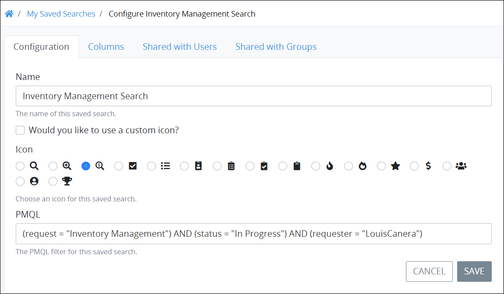
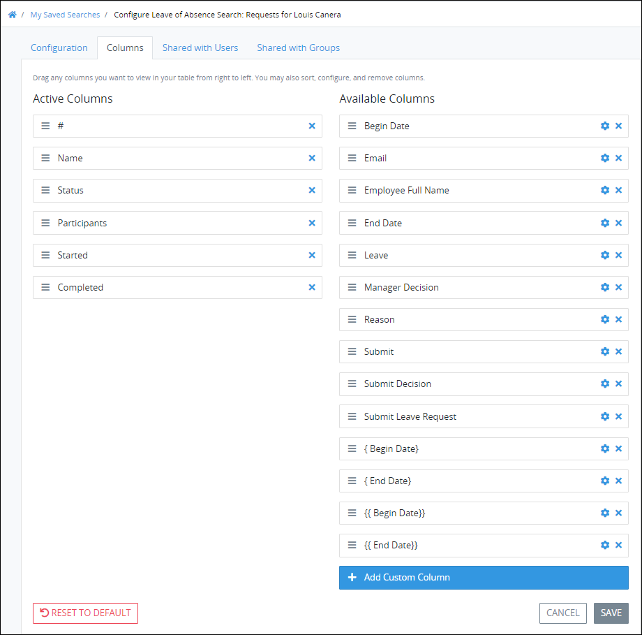

# Configure a Saved Search

## Configure a Saved Search


### Don't Know What a Saved Search Is?

See [What is a Saved Search?](../what-is-a-saved-search.md) to learn how you can share the same Request and Task search parameters with other ProcessMaker users in your organization.

### ProcessMaker Package Required

To configure a [Saved Search](../what-is-a-saved-search.md), the [Saved Searches package](../../../package-development-distribution/package-a-connector/saved-searches-package.md) must be installed in your ProcessMaker instance. The Saved Searches package is not available in the ProcessMaker open-source edition. Contact [ProcessMaker Sales](mailto:sales@processmaker.com) or ask your ProcessMaker sales representative how the Saved Searches package can be installed in your ProcessMaker instance.


You may configure only one of your own Saved Searches. Configure a Saved Search regardless of whether it is [visible](hide-or-show-a-saved-search.md#show-your-hidden-saved-search) or [hidden](hide-or-show-a-saved-search.md#hide-your-own-saved-search).

Follow these steps to select the Saved Search to configure:

1. [View the Shared Searches for a specific Saved Search type](./#manage-your-own-saved-searches). The **Edit Saved Searches** page displays.
2. Click the **Configure** icon for the Saved Search to configure. The **Configuration** tab displays.  
3. Edit the following information in the **Configuration** tab about the Saved Search as necessary:
   * In the **Name** field, enter the name of your Saved Search. This is a required field.
   * Follow these guidelines to select an image that represents the Saved Search results. Saved Searches associated with Requests display in the left sidebar of **Requests** pages, while those associated with Tasks display in the left sidebar of **Tasks** pages.

     **Follow this step to select an image from ProcessMaker to represent the Saved Search:**

     Select any of the images that ProcessMaker provides by selecting its radio button.

     **Follow these steps to select a custom image to represent the Saved Search:**

     1. Click the **Would you like to use a custom icon?** checkbox. The **Choose File** button displays.
     2. Click the **Choose File** button and locate the icon that represents the Saved Search. The icon must not be larger than 2 kilobytes large or the following message displays below the **Choose File** button: **The file is too large. File size must be less than 2KB when base64 encoded.**.

   * In the **PMQL** field, edit the ProcessMaker Query Language \(PMQL\) parameters if necessary. See the following topics for information how to use PMQL for Requests and Tasks:
     * [Request searches using PMQL](../../requests/search-for-a-request.md#advanced-search-for-a-request)
     * [Task searches using PMQL](../../task-management/search-for-a-task.md#advanced-search-for-a-task)
4. Click **Save** if no further configuration is required. Otherwise, continue.
5. Click the **Columns** tab. Use the **Columns** tab to customize a table from which to display search results for this Saved Search. The **Active Columns** column displays the currently selected columns that display information in the Saved Search's search results. The **Available Columns** column displays optional informational components to display in the Saved Search's search results. These available options are based on ProcessMaker's analysis of completed Requests for the Saved Search's selected Process. These optional informational components are derived from the [ProcessMaker Screen](../../../designing-processes/design-forms/what-is-a-form.md) control **Variable Name** setting values that the Saved Search's selected Process references in [Task](../../../designing-processes/process-design/model-your-process/process-modeling-element-descriptions.md#task) and [Manual Task](../../../designing-processes/process-design/model-your-process/process-modeling-element-descriptions.md#manual-task) elements.  
    

   It may be helpful to know how the ProcessMaker Screen controls that have the **Variable Name** field values are utilized in the Process referenced in your Saved Search. See [View the Variable Name Setting Values for ProcessMaker Screen Controls](configure-a-saved-search.md#view-the-variable-name-setting-values-for-processmaker-screen-controls).

6. Follow these guidelines to configure which columns display information in the Saved Search results:

   **Remove a column that displays information in the Saved Search results:**

   1. dfdfdfdf

   **Add and configure a column that displays information in the Saved Search results:**

   1. dfdfdf

7. dfdff

### View the Variable Name Setting Values for ProcessMaker Screen Controls

When [configuring a Saved Search](configure-a-saved-search.md#configure-a-saved-search), it may be helpful to know what the optional information components represent. These informational components are derived from the **Variable Name** setting values from the ProcessMaker Screen controls that the Saved Search's selected Process references in [Task](../../../designing-processes/process-design/model-your-process/process-modeling-element-descriptions.md#task) and [Manual Task](../../../designing-processes/process-design/model-your-process/process-modeling-element-descriptions.md#manual-task) elements.

Follow these guidelines to view the **Variable Name** setting values in ProcessMaker Screen controls:

1. [View your Processes](../../../designing-processes/viewing-processes/view-the-list-of-processes/view-your-processes.md#view-all-active-processes). Note that your ProcessMaker user account or group membership must have the Processes: View Processes permission to do so. See [Processes](../../../processmaker-administration/permission-descriptions-for-users-and-groups.md#processes) permissions or contact your ProcessMaker Administrator.
2. Edit the Process for the Requests/Tasks that your Saved Search references. Note that your ProcessMaker user account or group membership must have the Processes: Edit Processes permission to do so. See [Processes](../../../processmaker-administration/permission-descriptions-for-users-and-groups.md#processes) permissions or contact the Process Owner for that Process to continue to the next step.
3. Do the following for each Task element and Manual Task element in the Process model:
   * **Task elements:** Click each Task element and then make note of the ProcessMaker Screen referenced in the **Screen For Input** setting. See [Add and Configure Task Elements](../../../designing-processes/process-design/model-your-process/add-and-configure-task-elements.md#select-the-processmaker-screen-for-a-task-element).
   * **Manual Task elements:** Click each Manual Task element and then make note of the ProcessMaker Screen referenced in the **Summary screen** setting. See [Add and Configure Manual Task Elements](../../../designing-processes/process-design/model-your-process/add-and-configure-manual-task-elements.md#select-the-processmaker-screen-associated-with-the-manual-task).
4. [View your ProcessMaker Screens](../../../designing-processes/scripts/manage-scripts/view-all-scripts.md#view-all-processmaker-scripts). Note that your ProcessMaker user account or group membership must have the Screens: View Screen permission to do so. See [Screens](../../../processmaker-administration/permission-descriptions-for-users-and-groups.md#screens) permissions or contact your ProcessMaker Administrator.
5. Edit each ProcessMaker Screen referenced in each Task and/or Manual Task element\(s\) in the Process model. Note that your ProcessMaker user account or group membership must have the Screens: Edit Screen permission to do so. See [Screens](../../../processmaker-administration/permission-descriptions-for-users-and-groups.md#screens) permissions or contact the ProcessMaker Screen designer\(s\) to continue to the next step.
6. Click each control in each ProcessMaker Screen referenced by the Task/Manual Task element and make note of the **Variable Name** setting value for controls that have this setting.
7. Determine how each control with the **Variable Name** setting value is used during a Request.
8. Determine if that control's Request information should be referenced in your Saved Search. If so, consider using that Variable Name setting in your Saved Search.

## Related Topics

