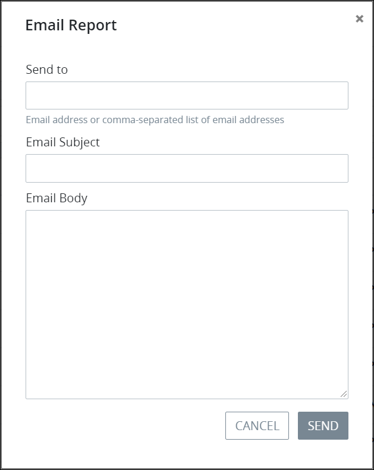

# Email a Report of Saved Search Results

## Email a Report of Saved Search Results


### Don't Know What a Saved Search Is?

See [What is a Saved Search?](../what-is-a-saved-search.md) to learn how you can share the same Request and Task search parameters with other ProcessMaker users in your organization.

### ProcessMaker Package Required

To email a report of search results for a [Saved Search](../what-is-a-saved-search.md), the [Saved Searches package](../../../package-development-distribution/package-a-connector/saved-searches-package.md) must be installed in your ProcessMaker instance. The Saved Searches package is not available in the ProcessMaker open-source edition. Contact [ProcessMaker Sales](mailto:sales@processmaker.com) or ask your ProcessMaker sales representative how the Saved Searches package can be installed in your ProcessMaker instance.


Email a report of the currently displayed search results for a Saved Search to one or more email recipients. In doing so, those search results are emailed as a comma-separated values \(`.CSV`\) file that can be opened in a spreadsheet editor. Separate multiple email recipients using commas.

Follow these steps to email a report of search results for a Saved Search:

1. [View the search results for a Saved Search](view-search-results-for-a-saved-search.md) in which to email its search results.
2. Click the **Send Report** button. The **Email Report** screen displays.  
3. In the **Send to** field, enter the email address\(es\) for the email recipients to receive the report. Separate multiple email recipients using commas.
4. In the **Email Subject** field, enter the email subject of your report to which the report will be attached.
5. In the **Email Body** field, enter the email body content for your report.
6. Click **Send**.

## Related Topics

