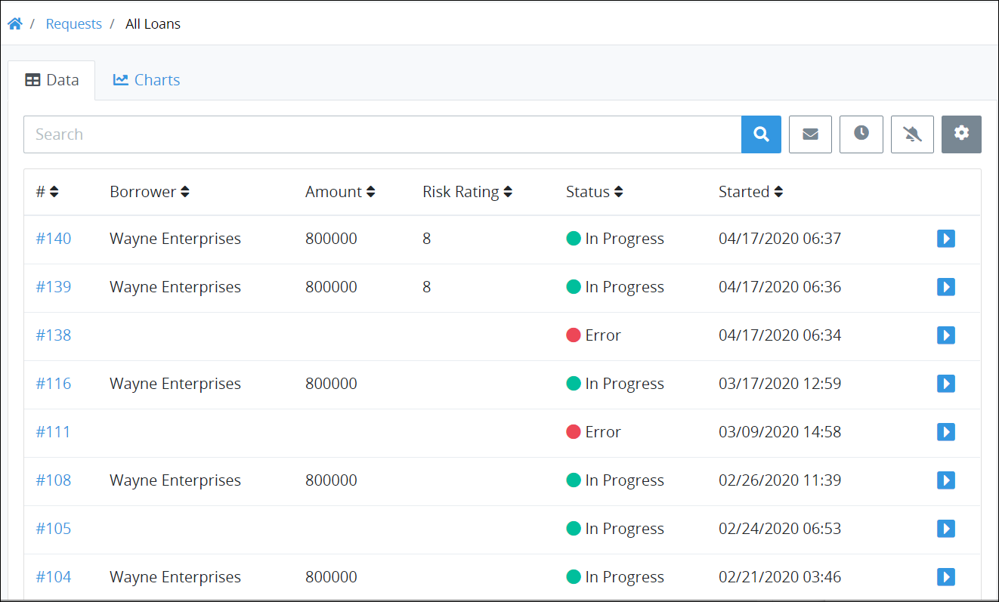
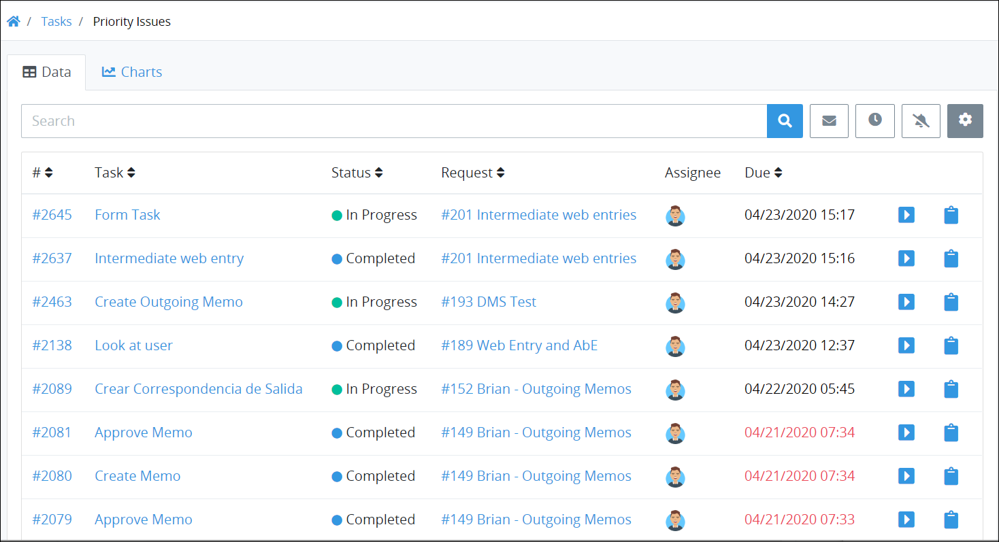
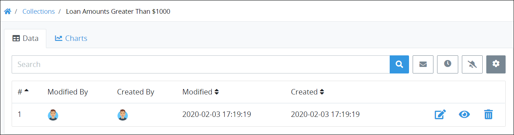

# View Results for a Saved Search

## Overview


### ProcessMaker Packages Required

To view search results for a [Saved Search](../what-is-a-saved-search.md), the [Saved Searches package](../../../package-development-distribution/package-a-connector/saved-searches-package.md) must be installed in your ProcessMaker instance. Likewise, to create or share Saved Searches for records in a ProcessMaker Collection, the Collections package must also be installed. Neither of these packages are available in the ProcessMaker open-source edition. Contact [ProcessMaker Sales](mailto:sales@processmaker.com) or ask your ProcessMaker sales representative how these packages can be installed in your ProcessMaker instance.


Regardless of whether you [created](../create-and-share-a-saved-search.md) a Saved Search or if it has been shared with you, you may view the search results based on the [ProcessMaker Query Language \(PMQL\)](../../search-processmaker-data-using-pmql.md) parameters configured in the Saved Search.

An image represents each Saved Search on the left sidebar, but only display on pages associated with its type. Saved Searches are organized by type:

* [Request](../../requests/what-is-a-request.md)-related Saved Searches are accessed from **Requests** pages
* [Task](../../task-management/what-is-a-task.md)-related Saved Searches are accessed from **Tasks** pages
* Saved Searches for ProcessMaker Collection records are accessed from the [**Collections** page](../../../collections/manage-collections/view-collections.md#view-all-collections)


### Don't Know What a ProcessMaker Collection Is?

See [What is a Collection?](../../../collections/what-is-a-collection.md).


Columns that display in the results for a Saved Search can be customized by the ProcessMaker [user](../../../processmaker-administration/add-users/what-is-a-user.md) that created the Saved Search. See the following topics:

* [Create and Share a Saved Search](../create-and-share-a-saved-search.md)
* [Configure a Saved Search](../manage-your-saved-searches/configure-a-saved-search.md)

If a Saved Search has been shared with you, you may not change the type of information that displays in its results.

### View Request Results from a Saved Search

Follow these steps to view Request results from a Saved Search:

1. Locate the image that represents the Saved Search from the left sidebar associated with its type. 
   * **Requests:** Access Request-related Saved Searches from the following **Requests** pages:
     * **My Requests** page. See [View Your Requests That You Started](../../requests/view-started-requests.md#view-your-requests).
     * **In Progress** page. See [View Requests That Are In Progress](../../requests/view-in-progress-requests.md#view-in-progress-requests-in-which-you-are-participating).
     * **Completed** page. See [View Completed Requests](../../requests/view-completed-requests.md#view-completed-requests-in-which-you-participated).
     * **All Requests** page. See [View All Requests](../../requests/view-all-requests.md#view-all-requests-in-your-organization). \(Note that your ProcessMaker user account must have the [**Requests: View All Requests** permission](../../../processmaker-administration/permission-descriptions-for-users-and-groups.md#requests) to view the **All Requests** page.\)
   * **Tasks:** Access Task-related Saved Searches from the following **Tasks** pages:
     * **To Do** page. See [View Tasks You Need to Do](../../task-management/view-tasks-you-need-to-do.md).
     * **Completed** page. See [View Completed Tasks](../../task-management/view-completed-tasks.md).
   * **ProcessMaker Collections:** Access Saved Searches related to ProcessMaker Collection records from the Collection page. \(Note that the ProcessMaker Collections package must be installed to your ProcessMaker instance. Your ProcessMaker user account or group membership must have the "Collections: View Collections" permission to view the list of ProcessMaker Collections unless your user account has the **Make this user a Super Admin** setting selected. See the ProcessMaker [Collections](../../../processmaker-administration/permission-descriptions-for-users-and-groups.md#collections) permissions or ask your ProcessMaker Administrator for assistance. Lastly, your ProcessMaker user account or group membership must have the **View** [record permission](../../../collections/manage-collections/configure-a-collection.md#configure-record-permissions-for-processmaker-users) from a Collection's configuration to view that Collection's records. See [Configure a Collection](../../../collections/manage-collections/configure-a-collection.md#configure-a-processmaker-collection) or ask the manager of that ProcessMaker Collection for assistance.\)
2. Click the image that represents the Saved Search. The results for that Saved Search display.


### Quickly View How Many Items Are in Your Saved Searches

Click the ProcessMaker logo in the left sidebar to expand the sidebar. View at a glance how many items are in **Requests**/**Tasks/Collections** pages, as well as Saved Searches for that type.  
 

### View a Saved Search for Requests That You Started

Click the **Started By Me** iconto view a Saved Search for Requests that you started. Note that the [Saved Searches package](../../../package-development-distribution/package-a-connector/saved-searches-package.md) must be installed to display this Saved Search. Otherwise, clicking the **Started By Me** icon displays the [**My Requests**](../../requests/view-started-requests.md) page.


Below are results for a Request-related Saved Search.

### View Task Results from a Saved Search

Below are results for a Task-related Saved Search.

Below are results for a Saved Search against records in a ProcessMaker Collection.


### View a Request Summary from Search Results

To [view a Request summary](../../requests/request-details/) from search results, do one of the following:

* From the **\#** column, click the Request number associated with the Process displaying in the **Name** column to view its summary. This number represents the sequential occurrence of that Process.
* Click the **Open Request** iconfor the Request to view its summary.

### View a Task Summary from Search Results

To view a [Task and its summary](../../task-management/view-a-task-summary.md#summary-for-an-assigned-task) from search results, do one of the following:

* From the **Task** column, click the Task name that you want to view.
* Click the **Open Task** iconfor the Task name that you want to view.

### View a ProcessMaker Collection Record from Search Results

To view a ProcessMaker Collection record from search results, do one of the following:

* Click the **Edit** iconfor the record you want to edit.

### Search for a Saved Search's Search Result

Use the [Search](search-for-a-saved-searchs-search-result.md) setting to filter the Saved Search's search results that display.

### No Search Results from the Saved Search?

If there are no search results from the Saved Search, the following message displays: **No Data Available**.

### Display Information the Way You Want It

[Control how tabular information displays](../../control-how-requests-display-in-a-tab.md), including how to sort columns or how many items display per page.


## Related Topics



















