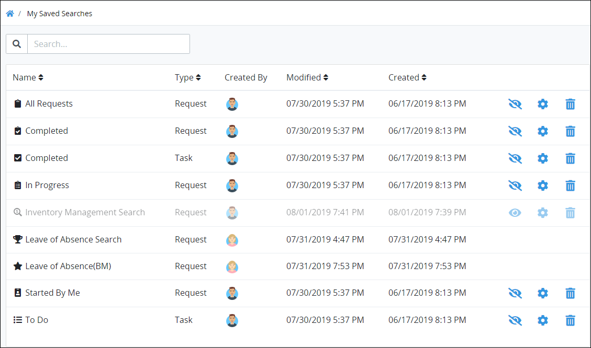
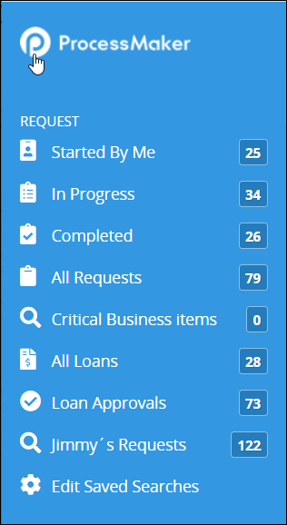

# What is a Saved Search?

## Overview


The [Saved Searches package](../../package-development-distribution/package-a-connector/saved-searches-package.md) must be installed in your ProcessMaker instance to use Saved Searches. The Saved Searches package is not available in the ProcessMaker open-source edition. Contact [ProcessMaker Sales](mailto:sales@processmaker.com) or ask your ProcessMaker sales representative how the Saved Searches package can be installed in your ProcessMaker instance.


Use the Saved Searches package to save and share search parameters associated with [Requests](../requests/what-is-a-request.md), [Tasks](../task-management/what-is-a-task.md) and [Collections](../../collections/what-is-a-collection.md). In doing so, you manage the search parameters for your Saved Searches. You may share your own Saved Searches with other ProcessMaker [users](../../processmaker-administration/add-users/what-is-a-user.md) and/or [groups](../../processmaker-administration/assign-groups-to-users/what-is-a-group.md). Recipients of your shared Saved Searches can only use your Saved Search to view its search results, but cannot modify your Saved Searches' parameter settings you configured. The name for a Saved Search does not need to be unique within your ProcessMaker instance. Therefore, multiple Saved Searches may have the same name when your own Saved Search and one shared with you have the same name.

Furthermore, you may schedule a regular interval in which to email reports for either your own Saved Searches or those shared with you.

Saved Searches have the following attributes:

* **Configure your Saved Searches:** You [create](create-and-share-a-saved-search.md) and [configure](manage-your-saved-searches/configure-a-saved-search.md) your own Saved Searches. Those that you share with others can only view its search results using the parameters configured in your Saved Searches.
* **Schedule to email reports of your Saved Search results:** You may [create one or more schedules](view-saved-searches-that-are-shared-with-you/schedule-to-email-reports-of-saved-search-results/schedule-an-interval-to-email-reports.md) to email reports for the search results for one of your own Saved Searches. Each schedule can email the report in `.CSV` or `.XLSX` format.
* **Hide Saved Searches:** You may hide your own Saved Searches. Hiding a Saved Search only hides that Saved Search from the left sidebar of your Request- and Task-related pages. Shared recipients of that Saved Search may still use it to view search results using your Saved Search's parameters.
* **Delete Saved Searches:** You may delete your Saved Searches. However, in doing so, they are no longer shared with those ProcessMaker users and/or groups with which you have shared them. The recipients of your shared Saved Search will no longer be able to use it to quickly view search results using your Shared Search's parameters.
* **Request-related Saved Searches:** Saved Searches associated with Requests display only in the left sidebar of Request-related pages.
* **Task-related Saved Searches:** Saved Searches associated with Tasks display only in the left sidebar of Task-related pages.
* **Collection-related Saved Searches:** Saved Searches associated with ProcessMaker [Collections](../../collections/what-is-a-collection.md) display on the left sidebar of ProcessMaker Collection pages. Note that the [Collections package](../../package-development-distribution/package-a-connector/collections.md) must be installed in your ProcessMaker instance for Collections to be available.

Click the **Edit Saved Searches** iconfrom the left sidebar in any of the **Requests**, **Tasks**, or **Collections** pages to view the **Edit Saved Searches** page. The **Edit Saved Searches** page displays both your own Saved Searches as well as those that others have shared with you for that search type. For example, clicking the **Edit Saved Searches** icon from the left sidebar of any of the **Requests** pages only displays Request-type Saved Searches. See [Manage Your Own Saved Searches](manage-your-saved-searches/).

An icon represents each Saved Search that the ProcessMaker user selects when [creating the Saved Search](create-and-share-a-saved-search.md). Saved Searches display above the **My Saved Searches** icon. Click the logo at the top of the left sidebar on any of the **Requests**, **Tasks**, or **Collections** pages to view search results for each Saved Search.

## Related Topics



















