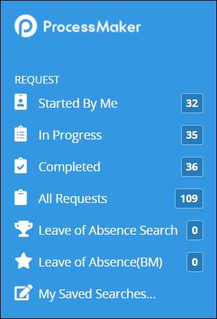

# What is a Saved Search?

## Overview


The [Saved Searches package](../../package-development-distribution/package-a-connector/saved-searches-package.md) must be installed in your ProcessMaker instance to use Saved Searches. The Saved Searches package is not available in the ProcessMaker open-source edition. Contact [ProcessMaker Sales](mailto:sales@processmaker.com) or ask your ProcessMaker sales representative how the Saved Searches package can be installed in your ProcessMaker instance.


Use the Saved Searches package to save and share searches associated with [Requests](../requests/what-is-a-request.md) and [Tasks](../task-management/what-is-a-task.md). In doing so, you manage the search parameters for your Saved Searches; recipients of the Saved Searches that you share can only view search results of those Saved Searches. Share your Request search with specific ProcessMaker [users](../../processmaker-administration/add-users/what-is-a-user.md) and/or [groups](../../processmaker-administration/assign-groups-to-users/what-is-a-group.md).

Saved Searches have the following attributes:

* **Configure your Saved Searches:** You configure your own Saved Searches. Those that you share with others can only view search results using the parameters configured in those Saved Searches.
* **Hide Saved Searches:** You may hide your Saved Searches. However, in doing so, they are no longer shared with those ProcessMaker users and/or groups with which you have shared them. Hiding a Saved Search only hides that Saved Search from you using it from the left sidebar of the Request- and Task-related pages. Sharing recipients of that Saved Search may still use it to view search results using your Saved Search's parameters.
* **Delete Saved Searches:** You may delete your Saved Searches. However, in doing so, they are no longer shared with those ProcessMaker users and/or groups with which you have shared them. The recipients of your shared Saved Search will no longer be able to use it to quickly view search results using your Shared Search's parameters.
* **Request-related Saved Searches:** Saved Searches associated with Requests display only in the left sidebar of Request-related pages.
* **Task-related Saved Searches:** Saved Searches associated with Tasks display only in the left sidebar of Task-related pages.

The **My Saved Searches** page displays both your saved Request- and Task-related Saved Searches, as well as those that others have shared with you. See [Manage Your Own Saved Searches](manage-your-saved-searches.md).

Access the search results of Saved Search from the left sidebar of the **Requests**- and **Tasks**- related pages. An icon represents each Saved Search that the ProcessMaker user selects when [creating the Saved Search](create-and-share-a-saved-search.md). Saved Searches display above the **My Saved Searches** icon. Click the left sidebar on **Requests** and **Tasks** pages to view search results for each Saved Search.

## Related Topics

