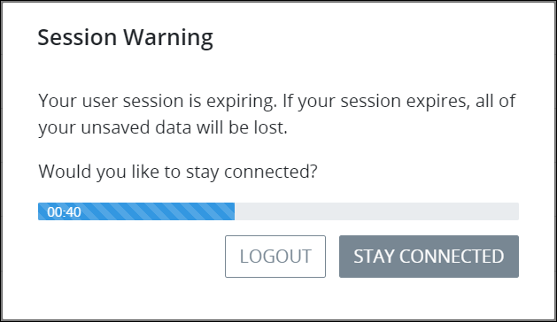

# Session Timeout Warning

## Session Timeout Warning

If you have not interacted with the ProcessMaker application in 120 minutes \(two hours\), ProcessMaker warns you that your log on session is almost expired. If your log on session expires, you will lose any unsaved work that may include any of the following:

* Information that you started entering into a [Task](task-management/what-is-a-task.md) but did not submit \(thereby completing the Task\) is lost.
*  Any [Process model](../designing-processes/process-design/what-is-process-modeling.md) changes that you made since the last time you saved the model are lost.
* Any [ProcessMaker Script](../designing-processes/scripts/what-is-a-script.md) changes that you made since the last time you saved the Script are lost.
* Any [ProcessMaker Screen](../designing-processes/design-forms/what-is-a-form.md) changes that you made since the last time you saved the Screen are lost.
* Any ProcessMaker [user account](../processmaker-administration/add-users/what-is-a-user.md) or [group](../processmaker-administration/assign-groups-to-users/what-is-a-group.md) changes you made but have not yet saved are lost.

As long as you are interacting with the ProcessMaker application, the session time out period does not begin to expire.

When 10% of the session timeout remains, a session timeout notice displays.

Click the **Stay Connected** button to renew your session before the timer indicator displays **00:00**. Otherwise, ProcessMaker logs you out automatically and any unsaved work is lost. If your session times out, you will need to [log on](log-in.md#log-on) again to continue using ProcessMaker.

## Related Topics

















