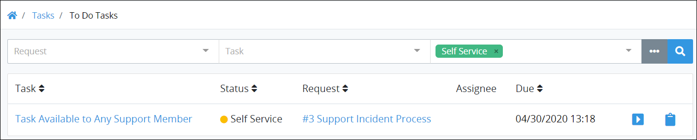

# Self-Assign Tasks to Yourself from a Queue

## View Self-Service Tasks That You Can Assign to Yourself

In some business environments it is beneficial to assign yourself Tasks. For example, a team of Support agents that answer customer questions for a product or service can provide faster customer service by self-assigning Tasks from a queue: the next available Support agent views the queue of self-service Tasks, and then assigns one to himself. After self-assigning a Task, that Task is no longer in the queue of self-assignable Tasks; the self-assignee must complete that Task to completion or reassign that Task to another ProcessMaker [user](../../processmaker-administration/add-users/what-is-a-user.md) if option is available for that Task.

Both [Tasks](../../designing-processes/process-design/model-your-process/add-and-configure-task-elements.md#select-to-whom-to-assign-the-task) and [Manual Tasks](../../designing-processes/process-design/model-your-process/add-and-configure-manual-task-elements.md#select-to-whom-to-assign-the-task) can be configured for self-service.

Follow these steps to view the queue of self-service Tasks from which to assign to yourself:

1. Ensure that you are [logged on](../log-in.md#log-in) to ProcessMaker.
2. Click the **Tasks** option from the top menu. The **To Do Tasks** page displays.
3. Click the **Self Service** iconin the left sidebar. The queue of self-service Tasks displays.
4. Click the **Claim Task** button to self-assign this Task. This Task moves from the **Self Service** page to your **To Do Tasks** page, and its status changes to In Progress.

Below is an example of the **Self Service** Task page that displays queued Tasks from which you can assign to yourself. The [Saved Search package](../../package-development-distribution/package-a-connector/saved-searches-package.md) is not installed in this example, so this page displays in the ProcessMaker open-source edition.

The **Self Service** Task page displays the following information in tabular format about all your completed Tasks:

* **Task:** The **Task** column displays the name of the Task. Click the Task name, and then click the **Claim Task** button to self-assign that Task.
* **Status:** The **Status** column displays the status of the Task. Since all Tasks in the **Self Service** page are Tasks that may be self-assigned, all Tasks display with the Self Service status, represented by the  icon.
* **Request:** The **Request** column displays the name of the Process associated with the Request. Click the Process name to [view the Request summary](../requests/request-details/).
* **Assignee:** The **Assignee** column in other Task-related pages displays the ProcessMaker user assigned a Task. Since all Tasks in the Self Service page are Tasks that have not been self-assigned, the **Assignee** column displays no information.
* **Due:** The **Due** column displays the date you completed was due. If **n/a** displays, then no due date was set to the Task. The time zone setting to display the time is according to the ProcessMaker instance unless your [user profile's](../profile-settings.md#change-your-profile-settings) **Time zone** setting is specified.


### Self-Assign a Task to View Its Summary

To view a [Task and its summary](view-a-task-summary.md#summary-for-an-assigned-task), do one of the following:

* From the **Task** column, click the Task name that you want to view, and then click the **Claim Task** button.
* Click the **Open Task** iconfor the Task name that you want to view, and then click the **Claim Task** button.

### View a Request Summary Associated with a Task

To [view a Request summary](../requests/request-details/), do one of the following:

* From the **Request** column, click the Request for the completed Task.
* Click the **Open Request** iconfor the Request associated with the Task.

### Search for a Task

Use Request data to search for Tasks on this page based on the following criteria:

* **Request:** Search using one or more Requests based on the Process names associated with the Request\(s\).
* **Task:** Search using one or more Task names as part of your search criteria.
* **Status:** Search using one or more of the following Task statuses:
  * **In progress:** Include Tasks that are assigned to you which are in progress or not started as part of your search criteria.
  * **Completed:** Include Tasks that are you have completed as part of your search criteria.
  * **Self service:** Include Tasks that you can assign to yourself, but have not yet been assigned.

You can do [basic](search-for-a-task.md#basic-search-for-a-task) and [advanced](search-for-a-task.md#advanced-search-for-a-task) searches for Tasks.

### Save the Settings of a Search

If the [Saved Searches package](../../package-development-distribution/package-a-connector/saved-searches-package.md) is installed in your ProcessMaker instance, you may save search parameters and share them with other ProcessMaker [users](../../processmaker-administration/add-users/what-is-a-user.md) and [groups](../../processmaker-administration/assign-groups-to-users/what-is-a-group.md) by clicking the **Save Search** button. See [Create and Share a Saved Search](../save-and-share-request-and-task-related-searches/create-and-share-a-saved-search.md).

If the Saved Searches package is not installed, the **Save Search** button is not available.

### Be Reminded of Overdue Tasks

If you have Tasks in the **To Do** Tasks page, a message displays above your completed Tasks how many overdue Tasks you have.  

Click the **To Do** icon in the left sidebar to view which of your assigned Tasks are overdue.

### No Self Service Tasks?

If there are no self service Tasks assigned to your ProcessMaker group, the following message displays: **No Results**.

### Display Information the Way You Want It

[Control how tabular information displays](../control-how-requests-display-in-a-tab.md), including how to sort columns or how many items display per page.


## Related Topics















