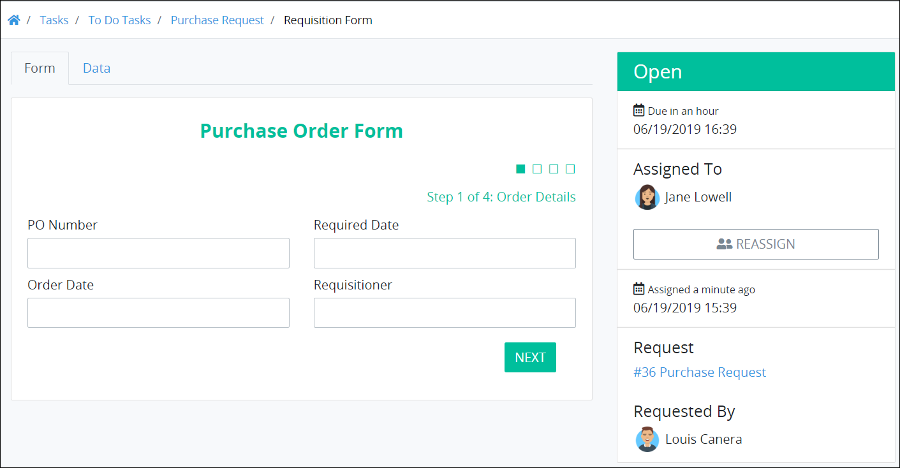
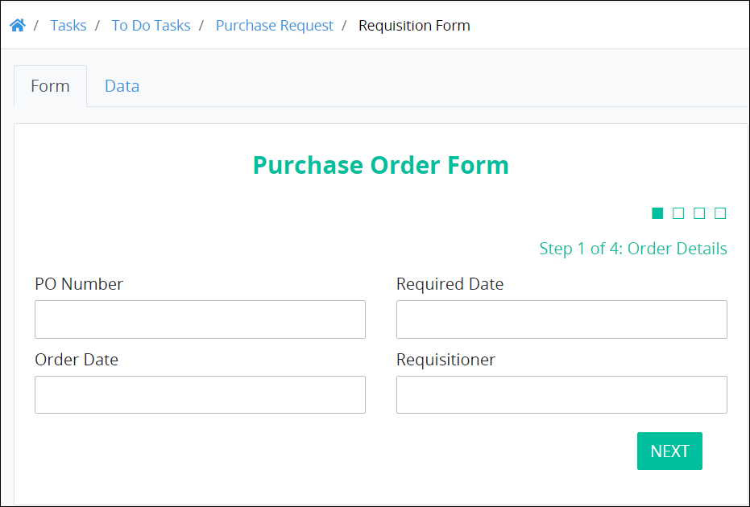
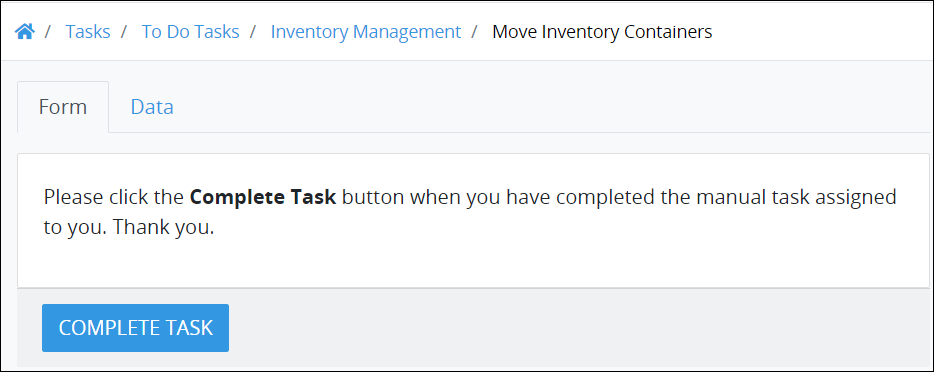
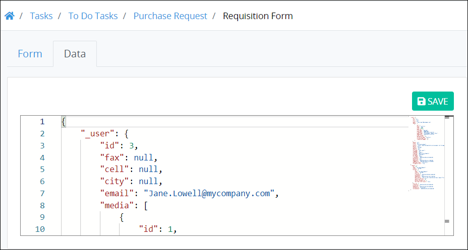
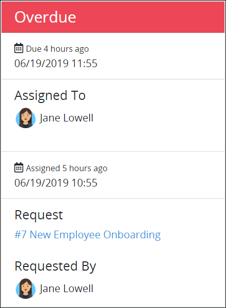
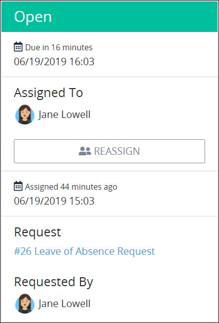
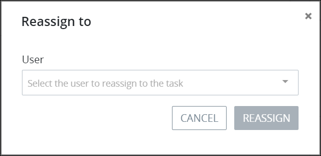
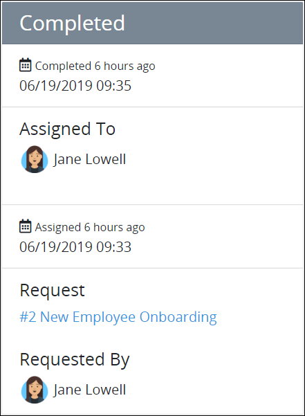

# View a Task Summary

## Summary for an Assigned Task

Follow these steps to view the summary for an assigned Task:

1. Ensure that you are [logged on](../log-in.md#log-on) to ProcessMaker.
2. [View all assigned Tasks.](view-tasks-you-need-to-do.md#view-your-assigned-tasks) The **To Do Tasks** page displays.
3. Click the name of the Task from the **Name** column. The Task's [form](view-a-task-summary.md#form), Request [data](view-a-task-summary.md#data), and Task [summary](view-a-task-summary.md#summary) display.

Below is an example of a Task summary.

### Task Form

The assigned Task displays in the **Form** tab. The **Form** tab displays by default when an assigned Task is opened. The Form tab displays information differently depending on whether ProcessMaker software is involved in the task's activity:

* **Forms in which ProcessMaker software is involved with the activity:** The **Form** tab displays an interactive [ProcessMaker Screen](../../designing-processes/design-forms/what-is-a-form.md), which is a [Form](../../designing-processes/design-forms/screens-builder/types-for-screens.md#form)-type Screen. Form-type ProcessMaker Screens allow Request participants to enter, review, and/or make decisions based on information in the form. Below is an example of a Task in which ProcessMaker software is involved with the activity.  

  

* **Forms in which ProcessMaker software is not involved with the activity:** The **Form** tab displays a ProcessMaker Screen that only displays a message. This is a [Display](../../designing-processes/design-forms/screens-builder/types-for-screens.md#display)-type Screen that allows the Task assignee to do a manual task in which ProcessMaker software is not directly involved, such as moving inventory containers. When the manual Task is complete, the Task assignee clicks the **Complete Task** button. Below is an example of a Task in which ProcessMaker software is not involved with the activity.  

  

### Editable Task Data


Your user account or group membership must have the "Requests: Edit Task Data" permission to edit Task data unless your user account has the **Make this user a Super Admin** setting selected.

See the [Request](https://processmaker.gitbook.io/processmaker/processmaker-administration/permission-descriptions-for-users-and-groups#requests) permissions or ask your ProcessMaker Administrator for assistance.


The **Data** tab displays in JSON format the data a previous participant of this Request entered. Values in the **Data** tab can be changed from those entered by the previous Request participant.

Follow these steps to edit and save the values from those entered by a previous Request participant:

1. View the **Data** tab.
2. From the editable JSON field, change the values from those entered by the previous Request participant to those that you want.
3. Click **Save**. The following message displays when the Request values are changed: **Request data successfully updated**.

### Summary

The Task summary displays general information about the assigned Task. The summary displays beside the assigned Task.

If the assigned Task is overdue, the summary's label displays **Overdue**.

If the assigned Task is not overdue, the summary's label displays **Open**.

The following summary displays about an assigned Task:

* **Due:** The **Due** field displays the date and time the assigned Task is due.
* **Assigned To:** The **Assigned To** field displays the avatar and full name of the person assigned the Task.
* **Assigned:** The date and time the Task was assigned displays below the **Assigned To** field. The **Reassign** button displays if the Task can be reassigned. The time zone setting to display the time is according to the ProcessMaker instance unless your [user profile's](../profile-settings.md#change-your-processmaker-settings) **Time zone** setting is specified.
* **Request:** The **Request** field displays the Process name associated with the Request preceded by its numerical iteration. Click the Process name to [view the Request summary](../requests/request-details/).
* **Requested By:** The **Requested By** field displays the avatar and full name of the person who started the Request. Hover your cursor over a user's avatar to view that person's full name.


### Reassign a Task

If the Task has been configured to allow the Task assignee to reassign the Task to another ProcessMaker user, the **Reassign** button displays in the Task summary.

Follow these steps to reassign a Task to another ProcessMaker user:

1. Click the **Reassign** button. The **Reassign to** screen displays.  

   

2. Select the user to whom to reassign the Task.
3. Click **Reassign**.

### What Happens if the Task Cannot Be Reassigned?

If the Task has not been configured that it can be reassigned, then the **Reassign** button does not display. Therefore, the Task assignee does not have the option to reassign the Task to another ProcessMaker user.


## Summary for a Completed Task

The Task summary displays general information about the completed Task. Follow these steps to view the summary for a completed Task:

1. Ensure that you are [logged on](../log-in.md#log-on) to ProcessMaker.
2. [View all completed Tasks.](view-completed-tasks.md#view-completed-tasks) The **Completed Tasks** screen displays.
3. Click the name of the Task from the **Name** column. The following message displays for the completed Task: **Task Completed**.  

   

   The summary displays for the completed Task.

The following summary displays about a completed Task:

* **Completed on:** The **Completed on** field displays the date and time the Task was completed.
* **Assigned To:** The **Assigned To** field displays the avatar and full name of the person assigned the Task.
* **Assigned:** The date and time the Task was assigned displays below the **Assigned To** field. The time zone setting to display the time is according to the ProcessMaker instance unless your [user profile's](../profile-settings.md#change-your-processmaker-settings) **Time zone** setting is specified.
* **Request:** The **Request** field displays the Process name associated with the Request preceded by its numerical iteration. Click the Process name to [view the Request summary](../requests/request-details/).
* **Requested By:** The **Requested By** field displays the avatar and full name of the person who started the Request. Hover your cursor over a user's avatar to view that person's full name.

## Related Topics

















