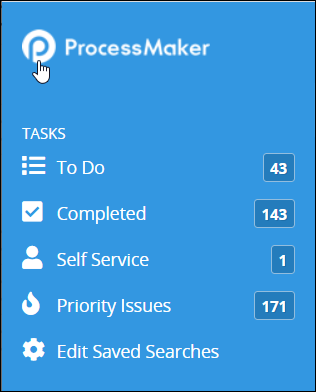
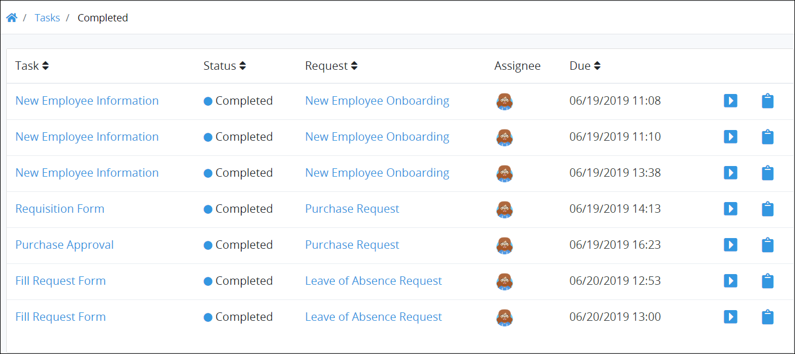

# View Completed Tasks

## View Completed Tasks

The **Completed** Tasks page displays all your completed Tasks.

Follow these steps to view all your completed Tasks:

1. Ensure that you are [logged on](../log-in.md#log-in) to ProcessMaker.
2. Click the **Tasks** option from the top menu. The **Completed** page displays.
3. Click the **Completed** icon in the left sidebar. All your completed Tasks display.


### Quickly View All Your Assigned and Completed Tasks

Click the ProcessMaker logo in the left sidebar to expand that sidebar. View at a glance how many Tasks you need to do, have completed, and can self-assign. Note that if the [Saved Searches package](../../package-development-distribution/package-a-connector/saved-searches-package.md) installed in your ProcessMaker instance, you can also view how many items are in your Saved Searches pertaining to Tasks.  
 


Below is an example of the **Completed** Task page that displays your completed Tasks. The Saved Search package is not installed in this example, so this page displays in the ProcessMaker open-source edition.

The **Completed** Task page displays the following information in tabular format about all your completed Tasks:

* **Task:** The **Task** column displays the name of the completed Task. If you click the Task name, the Task title displays with the following message: **Task Completed** along with [information about the completed Task](view-completed-tasks.md#view-information-about-a-completed-task).
* **Status:** The **Status** column displays the status of the Task. Since all Tasks in the **Completed** page are Tasks you have  completed, all Tasks display with the Completed status, represented by theicon.
* **Request:** The **Request** column displays the name of the Process associated with the Request. Click the Process name to [view the Request summary](../requests/request-details/).
* **Assignee:** The **Assignee** column displays the avatar for the username to whom the Task was assigned. Hover your cursor over a user's avatar to view that person's full name.
* **Due:** The **Due** column displays the date you completed was due. If **n/a** displays, then no due date was set to the Task. The time zone setting to display the time is according to the ProcessMaker instance unless your [user profile's](../profile-settings.md#change-your-profile-settings) **Time zone** setting is specified.


### View a Completed Task and Its Summary

To view a [completed Task and its summary](view-a-task-summary.md#summary-for-a-completed-task), do one of the following:

* From the **Task** column, click the Task name that you want to view.
* Click the **Open Task** iconfor the Task name that you want to view.

### View a Request Summary Associated with a Task

To [view a Request summary](../requests/request-details/), do one of the following:

* From the **Request** column, click the Request for the completed Task.
* Click the **Open Request** iconfor the Request associated with the Task.

### Search for a Task

Use Request data to search for Tasks on this page based on the following criteria:

* **Request:** Search using one or more Requests based on the Process names associated with the Request\(s\).
* **Task:** Search using one or more Task names as part of your search criteria.
* **Status:** Search using one or more of the following Task statuses:
  * **In progress:** Include Tasks that are assigned to you which are in progress or not started as part of your search criteria.
  * **Completed:** Include Tasks that are you have completed as part of your search criteria.

You can do [basic](search-for-a-task.md#basic-search-for-a-task) and [advanced](search-for-a-task.md#advanced-search-for-a-task) searches for Tasks.

### Save the Settings of a Search

If the [Saved Searches package](../../package-development-distribution/package-a-connector/saved-searches-package.md) is installed in your ProcessMaker instance, you may save search parameters and share them with other ProcessMaker [users](../../processmaker-administration/add-users/what-is-a-user.md) and [groups](../../processmaker-administration/assign-groups-to-users/what-is-a-group.md) by clicking the **Save Search** button. See [Create and Share a Saved Search](../save-and-share-request-and-task-related-searches/create-and-share-a-saved-search.md).

If the Saved Searches package is not installed, the **Save Search** button is not available.

### Be Reminded of Overdue Tasks

If you have Tasks in the **To Do** Tasks page, a message displays above your completed Tasks how many overdue Tasks you have.  

Click the **To Do** icon in the left sidebar to view which of your assigned Tasks are overdue.

### No Completed Tasks?

If there are no completed Tasks by anyone in your organization, the following message displays: **No Results**.

### Display Information the Way You Want It

[Control how tabular information displays](../control-how-requests-display-in-a-tab.md), including how to sort columns or how many items display per page.


## Related Topics













