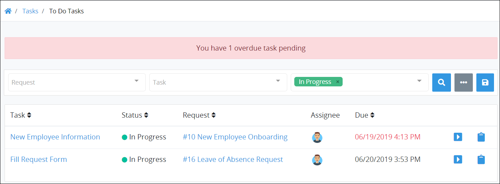

# View Tasks You Need to Do

## View Your Assigned Tasks

The **To Do Tasks** page displays all Tasks that are assigned to you.

Follow these steps to view your assigned Tasks:

1. Ensure that you are [logged on](../log-in.md#log-in) to ProcessMaker.
2. Click the **Tasks** option from the top menu. The **To Do Tasks** page displays. Tasks that display on this page are assigned to you.


Click the **To Do** icon in the left sidebar to view your assigned Tasks when you are viewing your completed Tasks.


~~RETAKE SCREENSHOT AFTER THE "STATUS" COLUMN IS REMOVED.~~

The **To Do Tasks** page displays the following information in tabular format about your assigned Tasks:

* **Task:** The **Task** column displays the name of the assigned Task. Click the Task name to [open the selected Task and view its summary](view-a-task-summary.md#summary-for-an-assigned-task).
* **Request:** The **Request** column displays the Request associated with the assigned Task. Click the Request name to [view the Request summary](../requests/request-details/).
* **Assignee:** The **Assignee** column displays your avatar since all Tasks in this display are assigned to you.
* **Due:** The **Due** column displays the date and time the Task is due. The time zone setting to display the time is according to the ProcessMaker instance unless your [user profile's](../profile-settings.md#change-your-profile-settings) **Time zone** setting is specified.


### View an Assigned Task and Its Summary

To view an [assigned Task and its summary](view-a-task-summary.md#summary-for-an-assigned-task), do one of the following:

* From the **Task** column, click the Task name that you want to view.
* Click the **Open Task** iconfor the Task name that you want to view.

### View a Request Summary Associated with a Task

To [view a Request summary](../requests/request-details/), do one of the following:

* From the **Request** column, click the Process name associated with the Request for the assigned Task.
* Click the **Open Request** iconfor the Request associated with the Task.

### Search for a Task

Use Request data to search for Tasks on this page based on the following criteria:

* **Request:** Search using one or more Requests based on the Process names associated with the Request\(s\).
* **Task:** Search using one or more Task names as part of your search criteria.
* **Status:** Search using one or more of the following Task statuses:
  * **In progress:** Include Tasks that are assigned to you which are in progress or not started as part of your search criteria.
  * **Completed:** Include Tasks that are you have completed as part of your search criteria.

You can do [basic](search-for-a-task.md#basic-search-for-a-task) and [advanced](search-for-a-task.md#advanced-search-for-a-task) searches for Tasks.

### Be Reminded of Overdue Tasks

A message displays above your assigned Tasks how many of those Tasks are overdue.  

Furthermore, the due dates for overdue Tasks display in a different color in the **Due** column than Tasks that are not overdue.

### No Assigned Tasks?

If there are no assigned Tasks, the following message displays: **No Results**.

### Display Information the Way You Want It

[Control how tabular information displays](../control-how-requests-display-in-a-tab.md), including how to sort columns or how many items display per page.


## Related Topics













