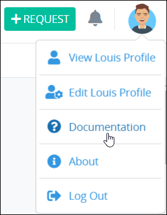

# View ProcessMaker Product Documentation

## View ProcessMaker Product Documentation

Follow these steps to view ProcessMaker product documentation:

1. [Log on](log-in.md#log-in) to ProcessMaker.
2. Click your user avatar.
3. Select **Documentation**.  
    

   The ProcessMaker product documentation displays in a new window.


See [ProcessMaker's Application Program Interface \(API\) documentation](https://staging-pm4.processmaker.net/api/documentation) if you are a developer or coding engineer who wants to learn how each function in the ProcessMaker interface has a corresponding API endpoint.


## Related Topics









